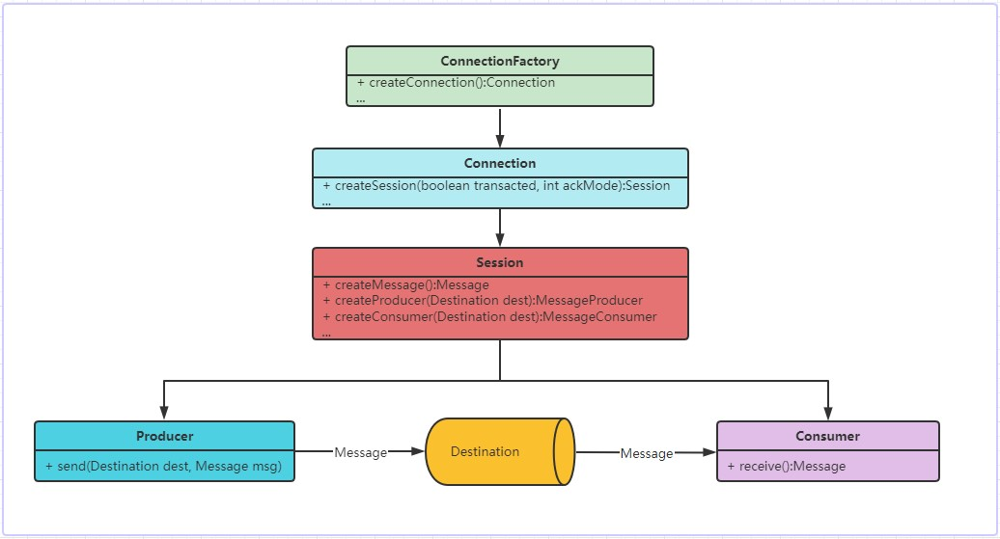
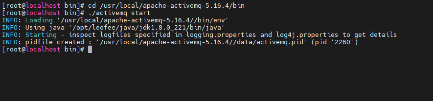
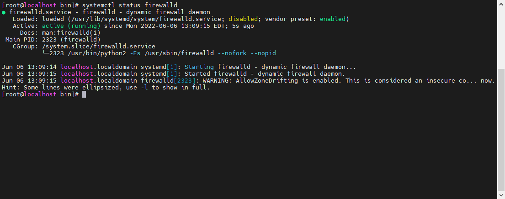
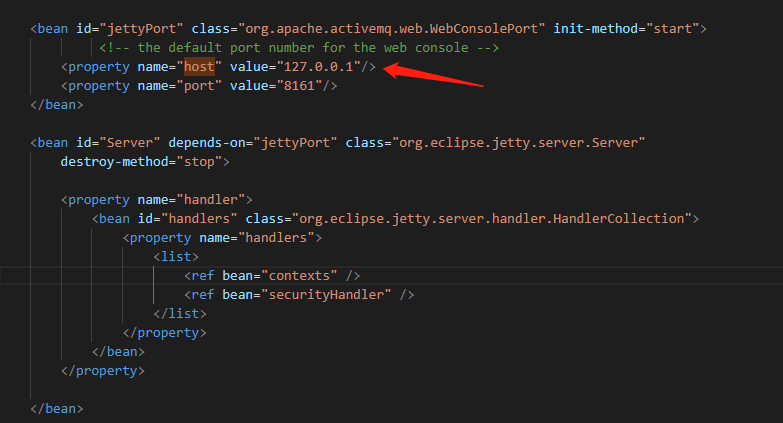

# ActiveMQ
在学习ActiveMQ之前，我们首先需要了解一下在Java平台的消息通讯的一个标准规范，即JMS：
> JMS即Java消息服务（Java Message Service）应用程序接口，是一个Java平台中关于面向消息中间件（MOM）的API，
> 用于在两个应用程序之间，或分布式系统中发送消息，进行异步通信。
> Java消息服务是一个与具体平台无关的API，绝大多数MOM提供商都对JMS提供支持。

通过JMS的介绍，我们发现其实`JMS`就是一套标准，具体的实现是交由具体的厂商去实现，就好像我们所熟知的`JDBC`一样，`JDBC`也是通过制定一套连接数据库
的标准接口，如`java.sql.Driver`数据库驱动接口，数据库厂商对该接口进行实现，这样一来，我们只需要面向`JDBC`标准进行开发，而无需关注数据库连接的底层细节。

## JMS中的标准接口
在JMS的标准中定义了如下一些标准接口：
- `javax.jms.ConnectionFactory`：与JMS服务建立连接的工厂对象，可以通过该工厂对象获取一个连接
- `javax.jms.Connection`：封装了客户端与JMS服务的虚拟连接
- `javax.jms.Session`：与JMS服务的会话，用于创建生产者（producer）、消费者（consumer）和消息（message）等。
  Session是生产和消费消息的一个单线程上下文，提供了一个事务性的上下文，所以一组发送和接收都被包含在一个原子操作中。
- `javax.jms.MessageProducer`: 由JMS会话创建的消息的生产者
- `javax.jms.MessageConsumer`：由JMS会话创建的消息的消费者
- `javax.jms.Destination`: 消息的目的地，指的是消息发送者需要将消息投递的目的地或者消费者消费消息的来源。
    - `javax.jms.Queue`: 队列模式，基于点对点的消息模型
    - `javax.jms.Topic`: 主题模式，基于订阅/发布的消息模型
- `javax.jms.Message`：JMS中的消息.

以上这些不仅仅是接口，也代表着在JMS整个框架中的各个角色，从下图可以看出它们之间是如何进行协作的：



而ActiveMQ就是JMS标准的一个典型的实现，下面我们再看一下，基于ActiveMQ是如何使用消息队列的。

## Provider 发送消息

生产者，消息生产者是由会话创建的一个对象，用于把消息发送到一个目的地（`Destination`）：

```java
    // 获取一个连接
    ActiveMQConnectionFactory connectionFactory = new ActiveMQConnectionFactory("admin", "admin", "tcp://192.168.248.131:61616");
    Connection connection = connectionFactory.createConnection();
	connection.start();

    // 以非事务方式(transacted = false)创建 session
    Session session = connection.createSession(false, Session.AUTO_ACKNOWLEDGE);

    // 创建队列
    Queue queue = session.createQueue("leofee_queue");

    // 创建消息的生产者
    MessageProducer producer = session.createProducer(queue);
    // 消息持久化
    producer.setDeliveryMode(DeliveryMode.PERSISTENT);

    // 发送消息到队列
    TextMessage textMessage = session.createTextMessage("hello");
	// 消息发送默认是异步的
    producer.send(queue, textMessage);
	// 关闭连接
	connection.close();
```

## Consumer 消费消息

消费者，消息消费者是由会话创建的一个对象，它用于接收发送到目的地的消息。
```java
    // 获取一个连接
    ActiveMQConnectionFactory connectionFactory = new ActiveMQConnectionFactory("admin", "admin", "tcp://192.168.248.131:61616");
    Connection connection = connectionFactory.createConnection();
    connection.start();

    // 以非事务方式(transacted = false)创建 session
    Session session = connection.createSession(false, Session.AUTO_ACKNOWLEDGE);

    // 指定消费的队列
    Queue queue = session.createQueue("leofee_queue");

    // 创建消息的消费者
    MessageConsumer consumer = session.createConsumer(queue);

    // receive 不指定时间，则该方法会阻塞，直到接收到消息
    Message message = consumer.receive();
	
```

消息的消费可以采用以下两种方法之一：
- 同步消费。通过调用消费者的receive方法从目的地中显式提取消息。receive方法可以一直阻塞到消息到达。
  ```java
    // receive 不指定时间，则该方法会阻塞，直到接收到消息
    Message message = consumer.receive();
  
    // receive 支持指定超时时间，当超过指定时间后，receive 会返回 null
    Message messageWithTimeOut = consumer.receive(10000);
  ```
- 异步消费。客户可以为消费者注册一个消息监听器，以定义在消息到达时所采取的动作。
  ```java
    consumer.setMessageListener(message -> {
        // 处理消息
    });
  ```

## Browser
Browser 在 ActiveMQ 中的角色是用于查看队列中的消息，类似于Java集合中的队列的`peek`，只是用于查看队列中的消息，而不消费队列中的消息，
区别是Browser可以遍历队列中的所有消息，而Java 的 `Queue#peek()` 只是查看队列尾部的消息。

```java
    QueueBrowser browser = session.createBrowser(queue);
    Enumeration enumeration = browser.getEnumeration();
    while (enumeration.hasMoreElements()) {
        System.out.println(enumeration.nextElement());
    }
```

## Message
消息是传送数据的单位，消息可以非常简单，如一个字符串，也可以很复杂， 如对象结构，消息的传递需要一个队列作为载体，即消息队列，
消息队列提供路由并保证消息的传递，如果发送消息时，接收者处于不可用状态，此时的消息会保留在队列中，直到成功的被接收者消费。

### 消息的类型

- TextMessage: 字符类型

- ActiveMQObjectMessage: 对象结构型数据

- MapMessage: k-v 键值对类型数据

- ByteMessage: 支持传输流

- ObjectMessage:序列化的java对象，要传输该类型的消息，在高版本的ActiveMQ中需要在`${ACTIVEMQ_HOME}/bin/env`中设置对应的包的白名单

  `-Dorg.apache.activemq.SERIALIZABLE_PACKAGES=com.leofee.*`

  同时在消费端也需要设置对应的包名白名单：

  `connectionFactory.setTrustedPackages(new ArrayList(Arrays.asList("org.apache.activemq.test,org.apache.camel.test".split(","))));`

  或者

  `connectionFactory.setTrustAllPackages(true);`

  参考文档：[https://activemq.apache.org/objectmessage.html](https://activemq.apache.org/objectmessage.html)

### 消息优先级

消息的优先级可以保证消息消费的顺序性,优先级从0~9,由低到高，默认的优先级是4
在设置优先级之前， 需要在`${ACTIVEMQ_HOME}/conf/activemq.xml`中开启优先级配置：
```xml
<policyEntry queue=">" prioritizedMessages="true"/>
```
在发送消息时，进行设置消息的优先级：
```java
// 在send时指定
producer.send(message, DeliveryMode.PERSISTENT, 9, 0);
// 在 producer 维度设置优先级
producer.setPriority(9);
```

消息优先级，底层依靠的是消息存储的索引排序，如：在基于kahadb日志文件持久化机制中， 优先级会参与索引的建立

### 消息的有效期

```java
// 在发送消息时指定超时时间
producer.send(message, DeliveryMode.PERSISTENT, 4, 100);
// 指定producer发送所有消息的有效期
producer.setTimeToLive(1000);
```
消息支持设置有效期，如果超出有效期，则会进入死信队列，可以通过死信队列进行重新消费。

### 消息可靠性机制

#### 1. 消息持久化

```java
// 设置开启消息持久化(默认就是PERSISTENT)
producer.setDeliveryMode(DeliveryMode.PERSISTENT);
```

消息持久化支持以下几种类型：
- kahadb：默认的持久化策略，利用本地日志存储，在ActiveMq目录的 `${ACTIVEMQ_HOME}/data/kahadb` 文件夹中
  * db.data：是存储消息的索引文件(数据结构为B树)，因为直接读取日志中的消息属于随机读写，性能低，有了索引，就可以大大减少随机读取的性能损耗。
  * db.redo：用于进行消息恢复
  * db-1.log：真正用于存放消息的日志文件，新的数据以append追加在文件末尾，所以始终都是顺序写入，存储速度更快，默认的文件大小是32M，当文件大小超出后，会进行递增，新建一个日志文件。
  * lock：
  
- jdbc：使用JDBC持久化方式，数据库默认会创建3个表，每个表的作用如下： 
  
  - activemq_msgs：queue和topic的消息都存在这个表中 
  - activemq_acks：存储持久订阅的信息和最后一个持久订阅接收的消息ID 
  - activemq_lock：跟kahadb的lock文件类似，确保数据库在某一时刻只有一个broker在访问
  
  数据库存储，需要在activemq.xml中配置数据库连接信息。
  
  1. 在`${ACTIVEMQ_HOME}/conf/activemq.xml`中添加一个数据库连接池的bean，并添加对应的数据库驱动和连接池的jar包到`/lib`目录下。
  ```xml
    <!-- 此处使用的是Druid数据库连接池 -->
    <bean id="mysql-ds" class="com.alibaba.druid.pool.DruidDataSource" destroy-method="close"> 
        <property name="driverClassName" value="com.mysql.jdbc.Driver"/> 
        <property name="url" value="jdbc:mysql://localhost:3306/learning?useUnicode=true&amp;characterEncoding=utf-8&amp;autoReconnect=true&amp;useSSL=false&amp;serverTimezone=GMT"/> 
        <property name="username" value="root"/>
        <property name="password" value="admin123"/>
        <property name="maxActive" value="200"/>
        <property name="poolPreparedStatements" value="true"/>
    </bean>
  ```
  2. 修改`persistenceAdapter`
  ```xml
    <persistenceAdapter>
        <!-- dataSource 引用上述配置的bean -->
        <jdbcPersistenceAdapter dataSource="#mysql-ds" createTablesOnStartup="true" /> 
    </persistenceAdapter>
  ```
  3. 当生产者生产消息的时候，MQ会通过异步的方式将数据写入到数据库中
  
- jdbc journal：这种方式克服了JDBC Store的不足，JDBC存储每次消息过来，都需要去写库和读库。 ActiveMQ Journal，使用延迟存储数据到数据库，当消息来到时先缓存到文件中，延迟后才写到数据库中。
当消费者的消费速度能够及时跟上生产者消息的生产速度时，journal文件能够大大减少需要写入到DB中的消息。

**当消息消费成功后，持久化中的消息就会被移除。**

#### 2. 消息是支持事务的

消息生产者支持事务：
````java
// 第一个参数为true表示开启事务机制
Session session = connection.createSession(true, Session.AUTO_ACKNOWLEDGE);
// 提交事务，只有当提交事务后，消费者才能消费消息
session.commit();
// 回滚事务，如果事务发生回滚，消息则不会出现在队列中
session.rollback();
````

消息消费者支持事务：
```java
// 消费者开启事务消费消息，则必须commit，消息才会从队列中移除
Session session = connection.createSession(true, Session.AUTO_ACKNOWLEDGE);
Queue queue = session.createQueue("leofee_trx");

MessageConsumer consumer = session.createConsumer(queue);

TextMessage receive = (TextMessage) consumer.receive();
String text = receive.getText();

// 消费者提交事务后消息才算消费成功，才会从队列中移除
session.commit();
```

#### 3. 消息确认 ACK

消息的成功消费可以分为三个阶段，消费者接受消息，消费者处理消息，消费者确认（ACK）。

- 消费者在开启事务的模式下，当发生commit时，消息也就随之ACK，如果只调用了`message.acknowledge()`但是没有commit，消息也就不会从队列移除。
  
```java
  // 消费者开启事务消费消息，则ACK机制默认是 SESSION_TRANSACTED 即使设置了CLIENT_ACKNOWLEDGE也是没有效果的
  Session session = connection.createSession(true, Session.CLIENT_ACKNOWLEDGE);
  
  Queue queue = session.createQueue("leofee_trx");
  
  MessageConsumer consumer = session.createConsumer(queue);
  
  TextMessage message = (TextMessage) consumer.receive();
  
  // commit后会自动ACK,消息才会从队列中移除
  session.commit();
```

- 消费者在非事务的模式下，消息的确认取决于设置的应答模式(Acknowledgement mode)，主要有以下几种：
    * `Session.AUTO_ACKNOWLEDGE`：当consumer.receive()方法返回时，或者从MessageListener.onMessage方法成功返回时，会自动确认消费者已经收到消息。
    * `Session.CLIENT_ACKNOWLEDGE`：客户端通过`Message#acknowledge`方法手动确认，如果消费者接收到消息没有显示调用acknowledge，
      消息就一直会存在队列中，还有一点需要注意的是，如果客户端一次性接受到10个消息， 但是在处理第5个的时候触发了acknowledge，
      这时候，会将所有的10个消息都进行确认，所以acknowledge是基于一个session层面的。
    * `Session.DUPS_OK_ACKNOWLEDGE`：Session不必确保对传送消息的签收，这个模式可能会引起消息的重复，但是降低了Session的开销，所以只有客户端能容忍重复的消息，才可使用。
  ```java
  // 消费者未开启事务，设置了CLIENT_ACKNOWLEDGE 手工进行ack
  Session session = connection.createSession(false, Session.CLIENT_ACKNOWLEDGE);
  
  Queue queue = session.createQueue("leofee_trx");
  
  MessageConsumer consumer = session.createConsumer(queue);
  
  TextMessage message = (TextMessage) consumer.receive();
  
  // 对接收到的消息进行ACK
  message.acknowledge();
  ```
    当存在多个消费者的情况下, 如果A消费者接收到某个消息没有被ack, 则其他消费者也不会收到对应的消息, 如果A消费者在ack的过程中, 连接断开,则该消息会被推送到其他消费者，从而防止消息的丢失。

批量确认消息
在ActiveMQ中默认是支持批量的去确认消息，这样可以提升MQ的性能，当然也可以手动进行关闭：

```java
new ActiveMQConnectionFactory("tcp://locahost:61616?jms.optimizeAcknowledge=false");
```

#### 4. 死信队列
某些消息如果比较重要，可以利用死信队列，防止消息丢失，然后再重新从死信队列中重新消费掉。

当消息在持久化模式下，设置了有效期，当消息过期时会进入到死信队列中，如果时非持久化模式下，消息过期不会进入死信队列，这种情况会产生消息丢失的风险，也可通过配置文件设置非持久化的消息也进入死信队列中。

默认的死信队列的名称为`ActiveMQ.DLQ`（支持自定义名称），支持指定队列对应的死信队列。

```xml
<policyEntry queue="leofee_queue" prioritizedMessages="true" >
	<deadLetterStrategy> 
		<individualDeadLetterStrategy   queuePrefix="leofee_DLQ." useQueueForQueueMessages="true" processNonPersistent="true"/> 
	</deadLetterStrategy> 
</policyEntry>
```

`queuePrefix="leofee_DLQ." ` 修改死信队列的名称。

`useQueueForQueueMessages="true"`: 使用死信队列保存过期消息。

`processNonPersistent="true"`表示非持久化的过期消息也会进入死信队列。


### 消息堆积

由于队列中的消息都是会存在物理内存中，如果大量消息产生堆积就会占用大量的内存空间。

场景：

- 由于消息过期后会进入死信队列，如果大量的消息未被及时处理全都进入到死信队列，但是死信队列的消息没有对应的消费者去处理，就会产生消息堆积。

### 独占消费者

默认情况下，一个消息队列中的消息默认是被多个消费者同时去消费的，也可以设置只有一个消费者去消费队列的所有消息，这样的消费者称为独占消费者。

```java
// 设置queue对应的消费者是独占消费者 consumer.exclusive=true
Queue queue = session.createQueue("leofee_exclusive_queue?consumer.exclusive=true");
// 此时的消费者就是独占消费者
MessageConsumer consumer = session.createConsumer(queue);
```


### 消息延迟发送

首先在配置文件中开启延迟和调度

**schedulerSupport="true"**

```xml
<broker xmlns="http://activemq.apache.org/schema/core" brokerName="localhost" dataDirectory="${activemq.data}" schedulerSupport="true">
```

```java
// 延迟
message.setLongProperty(ScheduledMessage.AMQ_SCHEDULED_DELAY, delay);
// 周期
message.setLongProperty(ScheduledMessage.AMQ_SCHEDULED_PERIOD, period);
// 重复
message.setIntProperty(ScheduledMessage.AMQ_SCHEDULED_REPEAT, repeat);
```

### 消息发送原理

#### 同步/异步发送消息

以下表格中是同步或者异步发送的默认策略：

|          | 开启事务 | 关闭事务 |
| -------- | -------- | ------- |
| 持久化   | 异步     | 同步     |
| 非持久化 | 异步     | 异步     |

除了上表格中的默认策略，我们也可以通过自定义设置实现异步发送：

```java
// connectionFactory级别设置
ActiveMQConnectionFactory connectionFactory = new ActiveMQConnectionFactory(
				"admin",
				"admin",
				"tcp://localhost:61616"
				);
connectionFactory.setUseAsyncSend(true);
// connection 级别设置
ActiveMQConnection connection = (ActiveMQConnection)connectionFactory.createConnection();
connection.setUseAsyncSend(true);
// 
```

由于异步发送可能会导致消息丢失，因为producer消息发送后，即使broker接收失败了，默认情况下是发送端是无法感知的，所以在异步发送时，我们可以利用`ActiveMQMessageProducer`发送消息时设置发送后的回调函数：

```java
ActiveMQMessageProducer producer = (ActiveMQMessageProducer) session.createProducer(asyncQueue);
producer.send(textMessage, new AsyncCallback() {
    @Override
    public void onSuccess() {
        // 消息发送成功
    }

    @Override
    public void onException(JMSException exception) {
        // 消息发送失败
    }
});
```

### 消息过滤

消费者在消费消息的时候也可以指定只消费某些消息，通过设置选择器，类似于负载均衡，保证消费者消费消息的压力是均衡的。

```java
// 生产者
Queue queue = session.createQueue("leofee_exclusive_queue");
MessageProducer producer = session.createProducer(queue);
TextMessage message = session.createTextMessage();
message.setText("leofee" + i);
// 注意是Property，而不是value
message.setIntProperty("age", i);
producer.send(message);


// 消费者
Queue queue = session.createQueue("leofee_exclusive_queue");
// 多个条件可以利用 and 进行连接
String selector = "age > 18";
MessageConsumer consumer = session.createConsumer(queue, selector);
```

需要注意的是，**消息的`selector`过滤的规则是根据message的`property`进行过滤，而不是针对message的消息体**。

### 消息反馈 Reply To

消息反馈指的是生产在发送消息时，指定 message 的 replyTo 目的地，当消费者消费时，可以通过 message 获取对应的 replyTo，这里的replyTo
也是一个Destination

```java
@Test
public void reply() throws Exception {
    CountDownLatch latch = new CountDownLatch(1);
    Connection connection = activeMQConnectionFactory.createConnection();
    connection.start();
    Session session = connection.createSession(false, Session.AUTO_ACKNOWLEDGE);
    Queue queue = session.createQueue("leofee_queue");
    // 消息发送
    MessageProducer producer = session.createProducer(queue);
    TextMessage textMessage = session.createTextMessage();
    textMessage.setText("hello");
    textMessage.setJMSReplyTo(new ActiveMQQueue("leofee_reply"));
    producer.send(textMessage);
	
    // 消息接收
    MessageConsumer consumer = session.createConsumer(queue);
    consumer.setMessageListener(message -> {
        TextMessage receivedMessage = (TextMessage)message;
        try {
            System.out.println("接收到消息：" + receivedMessage.getText());

            // 获取接收到消息的 Reply To
            Destination replyTo = receivedMessage.getJMSReplyTo();
            System.out.println("reply to：" + ((ActiveMQQueue)replyTo).getQueueName());
            
            // 创建 Reply To 的 Producer
            MessageProducer replyProducer = session.createProducer(replyTo);
            TextMessage replyToMessage = session.createTextMessage();
            replyToMessage.setText("world");
            replyProducer.send(replyToMessage);

            // 接受 Reply To 的 Consumer
            MessageConsumer replyConsumer = session.createConsumer(replyTo);
            replyConsumer.setMessageListener(replyMessage -> {
                try {
                    System.out.println("reply message:" + ((TextMessage)replyMessage).getText());
                } catch (JMSException e) {
                    e.printStackTrace();
                } finally {
                    latch.countDown();
                }
            });

        } catch (JMSException e) {
            e.printStackTrace();
        }
    });
    latch.await();
    connection.close();
}
```

### Requestor 同步消息

在 JMS 框架中，还提供一个同步阻塞式的消息发送，在ActiveMQ中，消息的发送都是基于异步的，这也是消息队列的主要特性，但是尽管主次，
在 JMS 中还是提供了这种基于同步阻塞的方式进行消息的发送，虽然在本质上违背了mq的异步通讯原则，但是mq还是能够提供应用解耦、异构系统的特性。

使用QueueRequestor发送消息后，会等待接收端的回复，如果收不到回复就会造成死等现象!而且该方法没有设置超时等待的功能：

```java
    // requestor 发送消息
    public void requestor() throws Exception {
        QueueConnection connection = this.activeMQConnectionFactory.createQueueConnection();
        connection.start();
        QueueSession session = connection.createQueueSession(false, Session.AUTO_ACKNOWLEDGE);

        Queue queue = session.createQueue("requestor_queue");

        QueueRequestor requestor = new QueueRequestor(session, queue);

        TextMessage message = session.createTextMessage();
        message.setText("hello requestor");

        System.out.println("requestor 开始发送消息");
        Message res = requestor.request(message);
        System.out.println("requestor 结束发送消息，reply = " + res);

        connection.close();
    }
```
```java
    // 消费端消费消息
    public void requestorConsumer() throws Exception {
        CountDownLatch latch = new CountDownLatch(1);
        QueueConnection connection = this.activeMQConnectionFactory.createQueueConnection();
        connection.start();
        QueueSession session = connection.createQueueSession(false, Session.AUTO_ACKNOWLEDGE);

        Queue queue = session.createQueue("requestor_queue");
        MessageConsumer consumer = session.createConsumer(queue);
        consumer.setMessageListener(message -> {
            try {
                System.out.println("requestor consumer 接收到消息" + ((TextMessage)message).getText());
                Destination replyTo = message.getJMSReplyTo();
                TextMessage textMessage = session.createTextMessage();
                textMessage.setText("你好 requestor，我接收到你发送过来的消息了：" + ((TextMessage)message).getText());
                MessageProducer producer = session.createProducer(replyTo);
                producer.send(textMessage);
                connection.close();
                latch.countDown();
            } catch (JMSException e) {
                e.printStackTrace();
            }
        });
        latch.await();
    }
```

底层的实现其实是基于ReplyTo 和 Receiver#receive() 方法阻塞实现，原理是 Requestor 发送消息时会默认设置一个 ReplyTo，并且创建 receiver 去
阻塞接受该Reply队列的消息，当真正的消费端消费消息后，需要同时向replyTo的队列中发送一条消息。

QueueRequestor#request() 方法源码如下：
```java
    public Message request(Message message) throws JMSException {
        // 设置 Reply to
        message.setJMSReplyTo(this.tempQueue);
        // 发送消息
        this.sender.send(message);
        // 同步阻塞等待 Reply To 队列的消息
        return this.receiver.receive();
    }
```

### JMSCorrelationID 消息会话ID
在上面所说的 ReplyTo 机制可以实现，消费者在获取到消息后通过 ReplyTo 队列 通知生产者当前消息已经消费了，但是当有很多个消息的时候，
生产者是无法知道某一个消息的具体情况的，所以ActiveMQ还提供了一个类似于会话ID的机制，即JMDCorrelationID，通过JMSCorrelationID
能够让生产者监测到每一条具体消息的消费情况，从而做到更细粒度的消息监控。 

## PrefetchSize消费缓冲与消息积压
在一般场景下，消费者端，一般来说消费的越快越好，broker的积压越小越好。
但是考虑到事务性和客户端确认的情况，如果一个消费者一次获取到了很多消息却都不确认，这会造成事务上下文变大，broker端这种“半消费状态”的数据变多，
所以ActiveMQ有一个prefetchSize参数来控制未确认情况下，最多可以预获取多少条记录，该设定类似于缓冲池，缓冲池的大小就是通过prepfetchSize设定，
该设置也决定了broker中队列消息在consumer上线时是主动推送还是由consumer主动拉取消息。

**Pre-fetch默认值**

| consumer type | default value |
| ------------- | ------------- |
| queue         | 1000          |
| queue browser | 500           |
| topic         | 32766         |
| durable topic | 1000          |


### 可以通过三种方式设置prefetchSize

1. **创建连接时按照ConnectionFactory整体设置**

```java
	ActiveMQConnectionFactory connectio nFactory = new ActiveMQConnectionFactory(
				"admin",
				"admin",
				"tcp://localhost:5671?jms.prefetchPolicy.all=50"
				);
```

2. **创建连接时对topic和queue单独设置**

```java
    ActiveMQConnectionFactory connectionFactory = new ActiveMQConnectionFactory(
				"admin",
				"admin",
				"tcp://localhost:5671?jms.prefetchPolicy.queuePrefetch=1&jms.prefetchPolicy.topicPrefetch=1"
				);
```

3. **针对某一个指定的destination单独设置**

```java
    Destination topic = session.createTopic("user?consumer.prefetchSize=10");
```

**注意：对destination设置prefetchsize后会覆盖连接时的设置值**

### 消息到底是推还是拉?

发送消息时是推向broker

获取消息时：

- 默认是一条一条的推
- 当customer的prefetchSize满的时候停止推消息
- 当customer的prefetchSize ==0时 拉取消息

以上的规则可以在源码`org.apache.activemq.broker.region.Queue#doActualDispatch` 方法中，在broker中准备分发消息的时候会根据
prefetchSize 进行判断`consumer.isFull()` 是否已经满了：

```java
            for (Subscription s : consumers) {
                if (s instanceof QueueBrowserSubscription) {
                    continue;
                }
                if (!fullConsumers.contains(s)) {
                    // 判断消费者的缓冲池是否已满
                    if (!s.isFull()) {
                        if (dispatchSelector.canSelect(s, node) && assignMessageGroup(s, (QueueMessageReference)node) && !((QueueMessageReference) node).isAcked() ) {
                            // Dispatch it.
                            s.add(node);
                            LOG.trace("assigned {} to consumer {}", node.getMessageId(), s.getConsumerInfo().getConsumerId());
                            iterator.remove();
                            target = s;
                            break;
                        }
                    }
                    // 如果已经满了则放入到已满消费者的集合中
                    else {
                        // no further dispatch of list to a full consumer to
                        // avoid out of order message receipt
                        fullConsumers.add(s);
                        LOG.trace("Subscription full {}", s);
                    }
                }
            }
```

在消息端也会进行判断，是否需要拉取消息：
```java
    @Override
    public Message receive() throws JMSException {
        checkClosed();
        checkMessageListener();
        
        // 发送拉取指令
        sendPullCommand(0);
        MessageDispatch md = dequeue(-1);
        if (md == null) {
            return null;
        }

        beforeMessageIsConsumed(md);
        afterMessageIsConsumed(md, false);

        return createActiveMQMessage(md);
    }

    protected void sendPullCommand(long timeout) throws JMSException {
        clearDeliveredList();
        // 根据 prefetchSize 进行判断，如果prefetchSize == 0 并且 未消费的消息为0
        if (info.getCurrentPrefetchSize() == 0 && unconsumedMessages.isEmpty()) {
            MessagePull messagePull = new MessagePull();
            messagePull.configure(info);
            messagePull.setTimeout(timeout);
            session.asyncSendPacket(messagePull);
        }
    }
```

### prefetchSize 导致消费倾斜

当MQ中的消息生产速度并不饱和，这时候当存在多个消费者负载均衡时，如果某一个消费者的`prefetchSize`设置的过大，则会导致消费倾斜的问题出现，因为设置prefetchSize后消费者会主动拉取消息，假设消费者在处理消息时有一些比较耗时的操作，就会导致消息的消费速度变慢，影响效率。

解决办法：将`prefetchSize = 1`，这样就可以避免消费者一次性拉取多条消息，从而产生消费倾斜的问题。


## ActiveMq 整合 Spring-boot

1. 添加依赖
```xml
        <dependency>
            <groupId>org.springframework.boot</groupId>
            <artifactId>spring-boot-starter-activemq</artifactId>
        </dependency>

        <!-- activemq 连接池的依赖 -->
        <dependency>
            <groupId>org.messaginghub</groupId>
            <artifactId>pooled-jms</artifactId>
        </dependency>
```
2. 在 `application.yml` 中配置mq
```yml
# active mq
spring:
  jms:
    cache:
      enabled: false
  activemq:
    broker-url: tcp://localhost:61616
    user: admin
    password: admin123
    pool:
      enabled: true
      # 连接池最大连接数
      max-connections: 10
      # 空闲的连接过期时间，默认为30秒
      idle-timeout: 0
```
3. 启动配置

```java
@EnableJms
@Configuration
public class ActiveMqConfig {

    /**
     * 基于 Queue 模式的
     *
     * @param jmsConnectionFactory 连接工厂
     * @return
     */
    @Bean
    public JmsListenerContainerFactory<?> queue(ConnectionFactory jmsConnectionFactory) {
        DefaultJmsListenerContainerFactory queueContainer = new DefaultJmsListenerContainerFactory();
        queueContainer.setConnectionFactory(jmsConnectionFactory);
        return queueContainer;
    }

    /**
     * 基于 Topic 模式的
     *
     * @param jmsConnectionFactory 连接工厂
     * @return
     */
    @Bean
    public JmsListenerContainerFactory<?> topic(ConnectionFactory jmsConnectionFactory) {
        DefaultJmsListenerContainerFactory queueContainer = new DefaultJmsListenerContainerFactory();
        queueContainer.setConnectionFactory(jmsConnectionFactory);
        // 自定义同时开启pub_sub和点对点模式，因为activeMQ 默认只支持一种模式
        queueContainer.setPubSubDomain(true);
        return queueContainer;
    }
}
```

## Linux 安装 Active MQ

1. 安装jdk，并配置好环境变量
2. [官网下载](https://activemq.apache.org/components/classic/download/) ActiveMQ 的tar.gz 
3. 解压 `tar -zxvf 压缩包名称`
4. 切换到activemq 的bin目录下，比如我放在了 `/usr/local` 目录下，
   `cd /usr/local/apache-activemq-5.16.4/bin/`
   在 `activemq/bin`下的`env`配置中指定java的安装路径
5. 启动 activemq 服务 `./activemq start`
   
    

## 访问Linux上的ActiveMq服务
本人使用的是VMware开启的Cent OS 7 的虚拟机为例。

1. 查看防火墙是否开启 `systemctl status firewalld`

    

    running 代表是开启的

2. 由于防火墙是开启的，首先需要开放activemq默认的8161端口，如果已经关闭了防火墙就可以忽略这一步
   ```shell
      # 开放8161端口，--permanent 代表永久，下次服务器重启也会有效
      firewall-cmd --zone=public --add-port=8161/tcp --permanent
      # 重载防火墙设置
      firewall-cmd --reload
      # 查询已经开放的端口
      firewall-cmd --list-ports
   ```

3. 防火墙设置好了之后，必须得开启activemq的远程访问

   切换到activemq的conf目录下，打开jetty.xml，找到下图中配置host

   ```shell
    cd /usr/local/apache-activemq-5.16.4/conf/
    vi jetty.xml
   ```
    
   
    默认为`127.0.0.1`表示本地访问，所以需要将host修改为 `0.0.0.0`开启远程访问。
   
4. 重启ActiveMQ `./activemq restart`，此时可以通过浏览器使用IP直接访问虚拟机Linux上的ActiveMQ服务

   
## ActiveMQ 支持的连接协议

官方文档 [Transport configuration options](https://activemq.apache.org/configuring-version-5-transports)

1. TCP：这是ActiveMQ默认的连接协议，并且是基于BIO模型。
2. NIO：NIO是基于TCP协议，但是是非阻塞，所以使用该协议会提升ActiveMQ的性能表现。
3. VM
  ...

要从 TCP 切换到 NIO，只需更改 URI 的方案部分。这是在代理的 XML 配置文件中定义的示例。

ActiveMQ服务端配置：
```xml
<broker>
  ...
  <transportConnectors>
    <transportConnector name="nio" uri="nio://0.0.0.0:61616"/>  
  </transportConnectors>
  ...
</broker>
```
客户端基于NIO连接需要在broker的url使用nio连接协议：
```java
ActiveMQConnectionFactory connectionFactory = new ActiveMQConnectionFactory(
				"admin",
				"admin",
				"nio://localhost:61617"
				);
```

## ActiveMQ 高可用

### Master / Slaver 主备模式
对于ActiveMQ在主备模式下，启动多个broker，共享同一数据源，多个broker同时启动时，会去竞争同一把互斥锁，成功获取锁的broker节点为
master节点，未成功获取锁的broker为slaver，这时候的slaver会处于等待互斥锁的状态，当master节点下线后，其他的slaver会自动争夺互斥锁，从而
晋升为master节点。

以下是可用的不同类型的主/从模式：

|主从型          |要求                       |优点       |缺点           |
|-------------- |---------------------------|-----------|--------       |
|共享文件系统    |	共享文件系统，例如 SAN   |	故障转移，自动恢复	|需要共享文件系统 |
|JDBC主从       |	共享数据库              |	故障转移，自动恢复	|需要共享数据库。也比较慢，因为它不能使用高性能|

#### Shared File System 共享文件
配置基于共享文件类型的主备模式

1. 修改`ActiveMQ/conf/activemq.xml`中对应的 persistenceAdapter 持久化的指定的目录，保证多个broker节点
共享同一持久化目录。
```xml
    <persistenceAdapter>
        <kahaDB directory="${activemq.data}/kahadb"/>
    </persistenceAdapter>
```

2. 修改对应的`transportConnector`对应的broker端口号

3. 在客户端连接broker的url设置为`failover:(tcp://broker1:61616,tcp://broker2:61617,tcp://broker3:61618)`
```java
 ActiveMQConnectionFactory connectionFactory
        = new ActiveMQConnectionFactory("admin", "admin123", "failover:(tcp://localhost:61616,tcp://localhost:61617)");
```

当master节点下线后，客户端也会自动切换到对应的新master节点上，从而实现主备模式的高可用。

> 官方文档 https://activemq.apache.org/shared-file-system-master-slave
#### JDBC Master Slaver

> 官方文档 https://activemq.apache.org/masterslave


#### Failover transport 可配置选项
在broker url 为 failover 下，还可以在broker url上设置一些额外的参数配置来实现某些效果，如
`failover:(tcp://localhost:61616,tcp://localhost:61617)?randomize=true`，`randomize=true`代表的含义是使用随机连接，
以达到负载均衡的目的，默认true，除了该参数，还有很多其他参数配置如下：

#### Transport Options

| Option Name                   | Default Value | Description                                                  |
| ----------------------------- | ------------- | ------------------------------------------------------------ |
| `backup`                      | `false`       | Initialize and hold a second transport connection - to enable fast failover. |
| `initialReconnectDelay`       | `10`          | The delay (in ms) before the *first* reconnect attempt.      |
| `maxCacheSize`                | `131072`      | Size in bytes for the cache of tracked messages. Applicable only if `trackMessages` is `true`. |
| `maxReconnectAttempts`        | `-1 | 0`      | **From ActiveMQ 5.6**: default is `-1`, retry forever. `0` means disables re-connection, e.g: just try to connect once. **Before ActiveMQ 5.6**: default is `0`, retry forever. **All ActiveMQ versions**: a value `>0` denotes the maximum number of reconnect attempts before an error is sent back to the client. |
| `maxReconnectDelay`           | `30000`       | The maximum delay (in ms) between the *second and subsequent* reconnect attempts. |
| `nested.*`                    | `null`        | **From ActiveMQ 5.9:** common URI options that will be applied to each URI in the list**.** |
| `randomize`                   | `true`        | If `true`, choose a URI at random from the list to use for reconnect. |
| `reconnectDelayExponent`      | `2.0`         | The exponent used during exponential back-off attempts.      |
| `reconnectSupported`          | `true`        | Determines whether the client should respond to broker `ConnectionControl` events with a reconnect (see: `rebalanceClusterClients`). |
| `startupMaxReconnectAttempts` | `-1`          | A value of `-1` denotes that the number of connection attempts at startup should be unlimited. A value of `>=0` denotes the number of reconnect attempts at startup that will be made after which an error is sent back to the client when the client makes a subsequent reconnect attempt. **Note**: once successfully connected the `maxReconnectAttempts` option prevails. |
| `timeout`                     | `-1`          | **From ActiveMQ 5.3**: set the timeout on send operations (in ms) without interruption of re-connection process. |
| `trackMessages`               | `false`       | Keep a cache of in-flight messages that will flushed to a broker on reconnect. |
| `updateURIsSupported`         | `true`        | **From** **ActiveMQ 5.4:** determines whether the client should accept updates from the broker to its list of known URIs. |
| `updateURIsURL`               | `null`        | **From ActiveMQ 5.4:** a URL (or path to a local file) to a text file containing a comma separated list of URIs to use for reconnect in the case of failure. |
| `useExponentialBackOff`       | `true`        | If `true` an exponential back-off is used between reconnect attempts. |
| `warnAfterReconnectAttempts`  | `10`          | **From ActiveMQ 5.10:** a value `>0` specifies the number of reconnect attempts before a warning is logged. A logged warning indicates that there is no current connection but re-connection is being attempted. A value of `<=0` disables the logging of warnings about reconnect attempts. |

> https://activemq.apache.org/failover-transport-reference.html

## 问题 Q & A

1. 如何防止消息丢失

 	2. 如何防止消息的重复消费

- 接口保证幂等性
  
3. 如何保证消费顺序

 4. 如果发送了100条消息到broker中，如果consumer在消费第50条消息时，mq发生了宕机，mq重启后是否可正确的从弟51条开始消费？

    A: 如果配置了持久化策略，则重启后消息不会丢失，如果消息没有设置优先级，则还可以从原来的第51条开始消费，如果不是AutoAcknowledge，则不会从第51条，而是从第50条

