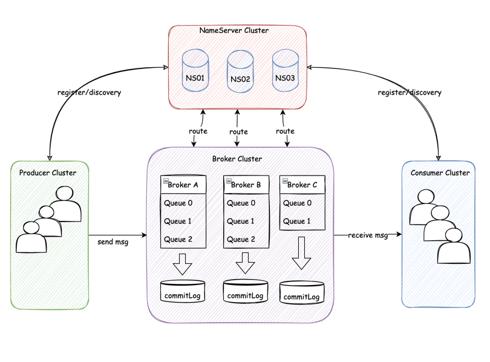
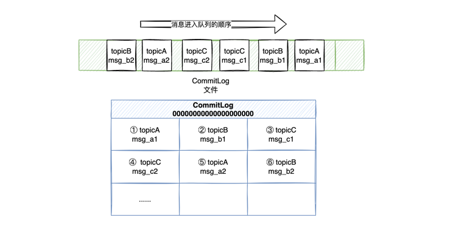
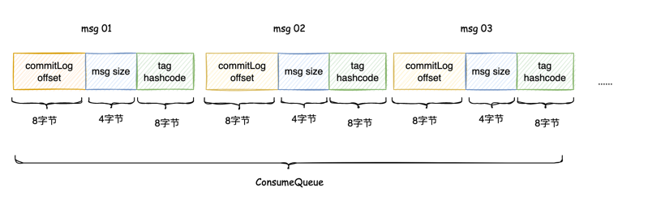

# Rocket MQ
RocketMQ是一个典型的发布-订阅的系统，即消息中间件，通过RocketMQ可以实现应用之间的解耦，微服务之间的异步调用，对于高并发场景下请求削峰等。

当然除了这些基本的消息队列功能外，RocketMQ相对于早期的老牌消息中间件如ActiveMQ，在应对当前互联网普遍存在的3H（高并发，高可用，高性能）环境更加得心应手，RocketMQ是阿里开源的消息中间件，经历过多次双十一的洗礼，它的性能、稳定性和可靠性都是值得信赖的，这也是它为何能够成为后起之秀的原因。

至于为何RocketMQ能够很好的应对当前互联网的3H，我们可以先看下RocketMQ的简单架构图：



从上图我们可以看出，在RocketMQ中，几乎所有的组件实现了灵活的多分区和多副本机制，有效的避免了集群内单点故障对于整体服务可用性的影响，这也是RocketMQ的核心所在，下面我们先挨个看一下在RocketMQ中一些组件的介绍。

## Broker

Broker 在RocketMQ中的职责就是接收处理生产者发送过来的消息，并将消息中转给对应的消费端，从而实现生产者和消费者的解耦，除此之外，为了保证消息的可靠性，Broker还实现了消息的持久化。

当Broker启动时，会向所有`NameServer`注册自己的相关信息，如地址，当前`Broker`中的`Topic`信息等，后续会周期性的向`NameServer`发送心跳。

- 启动流程:`BrokerStartUp#start() -> BrokerController#registerBrokerAll() -> BrokerOutAPI#registerBrokerAll()`
- 发送心跳: `BrokerController#scheduleSendHeartbeat()`


## NameServer
NameServer 是独立的一个无状态组件，接受 Broker 的元数据注册并动态维护着一些映射关系，同时为客户端（生产者和消费者）提供服务发现的能力，本质上类似于一个注册中心。
NameServer内部维护的信息有以下几种：

- 路由信息
    * RocketMQ中的消息主题`Topic`相关的信息
    * RocketMQ中消息服务`Broker`地址相关信息
    * RocketMQ中`Broker`与`Topic`的对应关系
    * RocketMQ中`Broker Cluster`和`Broker`的对应关系
    
- 消费者组 `Consumer Group`

在NameServer在内部维护了一个`BrokerAddrTable`，记录了所有Broker的信息， 当Broker向Nameserver发送注册请求时，
交由`DefaultRequestProcessor#processRequest`进行处理请求，在该方法内部根据`RemotingCommand`中的请求code`RequestCode`来区分当前的请求具体是哪一种类型，如`RequestCode#REGISTER_BROKER`Broker注册，当接受到注册Broker的请求时，会执行`RouteInfoManager#registerBroker`，将申请注册的Broker信息添加到`RouteInfoManager#brokerAddrTable`中。除了将Broker信息注册后，还会对将Broker中的Topic以及Queue信息进行注册，Topic相关的信息都是存在`TopicConfig`中，将Topic存储到`RoutingInfoManager#topicQueueTable`

## Producer

当消息的生产者发送消息时，首先会通过NameServer寻找对应的Topic和Broker的路由规则，即消息发送的目的地（Destination）。

## Consumer


## 发送消息

### 同步阻塞发送消息

```java
    // 1. 设置生产者组 producer
    DefaultMQProducer producer=new DefaultMQProducer("hello_world_producer_group");
    // 2. 指定 name server
    producer.setNamesrvAddr("192.168.248.131:9876");
    Message message = new Message("hello_world","hello rocketmq".getBytes());
    producer.start();
    // 同步消息发送
    SendResult sendResult = producer.send(message);
    System.out.println(sendResult);
```

### 批量发送消息

```java
    // 批量发送
    List<Message> messageList = new ArrayList<>();
    for (int i = 0; i < 5; i++) {
        messageList.add(new Message("test_tag", "TAG-B", ("hello rocketmq" + i).getBytes()));
    }
    SendResult sendBatch = producer.send(messageList);
```

### 异步发送
由于异步发送存在消息丢失的可能性，所以需要增加一个发送的回调通知，在回调函数中处理发送失败和发送成功的具体处理逻辑。

```java
    // 异步发送
    producer.send(new Message("hello_world", "hello rocketmq async".getBytes(StandardCharsets.UTF_8)), new SendCallback() { 
        @Override
        public void onSuccess(SendResult sendResult) {
            System.out.println("async send result: " + sendResult);
        }   
        @Override
        public void onException(Throwable e) {
            e.printStackTrace();
        }
    });
```

### 指定Queue发送消息 MessageQueueSelector
指定消息发送的Queue通常用于控制消息发送的顺序，在RocketMQ中Topic下会存在多个Queue，如果不指定对应的Queue，那么消息会分布在Topic下的多个Queue中，这样就无法保证消息在MQ中的顺序，所以只有发送的消息都在同一个Queue中才能够保证消息的顺序，RocketMQ中在发送消息的时候，可以用通过使用`MessageQueueSelector`进行指定消息发送的目标Queue， 即在DefaultMQProducer中的send方法支持传入一个MessageQueueSelector。

```java
    DefaultMQProducer producer = new DefaultMQProducer("orderly_producer_group");
    producer.setNamesrvAddr("192.168.248.131:9876");
    producer.start();   
    for (int i = 0; i < 20; i++) {
        Message message = new Message("orderly_topic", ("order_" + i).getBytes());
        producer.send(message, new MessageQueueSelector() {
            @Override
            public MessageQueue select(List<MessageQueue> mqs, Message msg, Object arg) {
                // 这里可以根据一定的规则将消息发送到指定的Queue中
                return mqs.get(0);
            }
        }, "");
    }
```

## 消费消息
消费者消费，在RocketMQ中支持两种模式：
- MessageModel.CLUSTERING（集群）: 该模式为默认的，类似于P2P模式，在该模式下，一个*ConsumerGroup*中只会有一个Consumer 会接收到对应的消息进行消费，如果多个consumerGroup都同时订阅该Topic则，多个consumerGroup都会消费到数据，所以才有了集群的概念。
   ```java
       DefaultMQPushConsumer consumer = new DefaultMQPushConsumer("hello_world_consumer_group");
       // Name Server
       consumer.setNamesrvAddr("192.168.248.131:9876");
       // 消费者组
       consumer.setConsumerGroup("hello_world_consumer_group");
       // * 代表接收该Topic 下的所有消息
       consumer.subscribe("hello_world", "*");
       // 注册消息监听
       consumer.registerMessageListener((MessageListenerConcurrently) (msgs, context) -> {
           for (MessageExt msg : msgs) {
                System.out.println(new String(msg.getBody()));
           }
           return ConsumeConcurrentlyStatus.CONSUME_SUCCESS;
       }); 
       // 开始接收消息
       consumer.start();
   ```
  
- MessageModel.BROADCASTING（广播）:该模式为广播模式，订阅了对应的Topic，所有的消费者都会接收到对应的消息，在消费端设置消费模式`consumer.setMessageModel(MessageModel.BROADCASTING);`

### 消息消费的ACK机制
在RocketMQ中，消息的ACK机制是依靠MessageListener的返回值进行决定：
- ConsumeConcurrentlyStatus.CONSUME_SUCCESS
- ConsumeConcurrentlyStatus.RECONSUME_LATER

### 消息过滤

-  通过 `Tag` 过滤消息，`Tag`是用于进行业务上的归类，如果说Topic是一级分类，那Tag就是二级分类

   1. 生产者生产消息时指定消息的具体`Tag`
   ```java
       DefaultMQProducer producer = new DefaultMQProducer("hello_world_producer_group");
       producer.setNamesrvAddr("192.168.248.131:9876");
       producer.start();
       // Message 的 构造方法支持指定 Tag
       Message message = new Message("test_tag", "TAG-A", "hello world rocket tag filter".getBytes());
       SendResult sendResult = producer.send(message);
   ```
   
   2. 消费者消费消息时，指定对应的过滤策略
   ```java
       DefaultMQPushConsumer consumer = new DefaultMQPushConsumer("hello_world_consumer_group");
       consumer.setNamesrvAddr("192.168.248.131:9876");
       consumer.registerMessageListener((MessageListenerConcurrently) (msgs, context) -> { 
           for (MessageExt msg : msgs) {
               System.out.println(new String(msg.getBody()));
           }   
           return ConsumeConcurrentlyStatus.CONSUME_SUCCESS;
       });
       // 指定只处理指定Tag的消息
       consumer.subscribe("test_tag", "TAG-A");
       consumer.start();
   ```
- 通过 SQL 方式过滤消息
   要使用SQL模式进行消息过滤，需要在RocketMQ的conf/broker.xml 中设置`enableProteryFilter=true`
   
   1. 生产者生产消息时设置对应的 `Property`
   ```java
       DefaultMQProducer producer = new DefaultMQProducer("hello_world_producer_group");
       producer.setNamesrvAddr("192.168.248.131:9876");
       producer.start();   
       // 批量发送 List<Message> messageList = new ArrayList<>();  for (int i = 0; i < 5; i++) {
       Message message = new Message("test_tag", "TAG-B", ("hello rocketmq" + i).getBytes());
       // 设置对应的属性
       message.putUserProperty("order", i + "");
       messageList.add(message);
       SendResult sendBatch = producer.send(messageList);
   ```
   
   2. 消费者消费消息：
   ```java
       DefaultMQPushConsumer consumer = new DefaultMQPushConsumer("hello_world_consumer_group");
       consumer.setNamesrvAddr("192.168.248.131:9876");
       consumer.registerMessageListener((MessageListenerConcurrently) (msgs, context) -> { 
           for (MessageExt msg : msgs) {
               System.out.println(new String(msg.getBody()));
           }   
           return ConsumeConcurrentlyStatus.CONSUME_SUCCESS;
       });
       // 创建对应的过滤器
   		MessageSelector selector = MessageSelector.bySql("order > 5 and order <= 10 ");
   		consumer.subscribe("test_tag", selector);
   		consumer.start();
   ```

>Key 一般用于消息在业务层面的唯一标识。对发送的消息设置好 Key，以后可以根据这个 Key 来查找消息。比如消息异常，消息丢失，进行查找会很 方便。
RocketMQ 会创建专门的索引文件，用来存储 Key 与消息的映射，由于是 Hash 索引，应尽量使 Key 唯一，避免潜在的哈希冲突。

### 如何保证消息消费的顺序
在RocketMQ中，以Topic作为broker中最小的逻辑单位，在一个Topic中还包含若干个Queue，真正保存消息的其实还是Queue，只有在同一个Queue中的消息才是有序的，即先进先出，FIFO。

生产者发送消息保证顺序需要做到以下几点：
1. 在保证消息的消费顺序前，首先需要保证在发送消息到RocketMQ中的发送顺序，建议使用单线程去发送。
2. 消息发送时，需要将消息都发送到同一个Queue中，利用RocketMQ中send(msg, MessageQueueSelector, args)方法指定对应的Queue。

消费者消费消息保证顺序：
1. 消费者消费注册监听器应该使用 MessageListenerOrderly而不是MessageListenerConcurrently

### 消费者如何监听broker是否存在消息(消息同步机制)
1. 普通轮询机制，间隔一定周期向server端broker发起请求，查看是否有消息存在，这种方式当消费者数量比较大，会消耗server端性能，因为会发送大量无用请求。
   
2. 长连接，客户端与server端建立长连接，当服务端产生消息则实时推送给客户端进行消费，优点是实时性高，缺点是，server端需要与大量客户端建立连接，并且需要维护客户端的状态，而且当大量消息产生，采用推送的方式，由于无法感知消费端的消费能力，所以会导致消费端的消息积压。
   
3. 长轮询，客户端与server端进行连接，如果server端没有消息，则将连接进行挂起，当收到消息则告诉消费端，将主动权移交给客户端，进行拉取消息进行消费，这样消费端可以根据自身的消费能力进行消息消费。
   在RocketMQ中实现为`org.apache.rocketmq.broker.longpolling.PullRequestHoldService`
### 消息的消费是Push还是Pull

- DefaultLitePullConsumer

- DefaultMQPushConsumer

### 消费者启动流程分析

1. 默认的消费者 `DefaultMQPushConsumer`，从该类的名称上看，消费消息的机制是按照Push的方式，其实在底层还是有consumer从broker中拉取消息。
2. 消费者启动 `DefaultMQPushConsumer#start();`
2. 消费者启动 `DefaultMQPushConsumerImpl#start();`
3. 创建MQ客户端实例`this.mQClientFactory = MQClientManager.getInstance().getOrCreateMQClientInstance(this.defaultMQPushConsumer, this.rpcHook);`
   这一步会初始化`PullMessageService`，用于执行拉取消息。
4. `mQClientFactory.start();`
5. `PullMessageService#start();` 执行`run()`，开始拉取消息。

## 消息持久化 CommitLog

一个消息中间件是否优秀，可靠性也是一个重要的衡量标准，RocketMQ和市面上很多中间件一样，除了可以提供高性能外，也提供了可靠的容灾机制，保证可靠性，就必须对消息进行持久化，这样就能够保证即使服务器宕机消息数据也不会丢失，可以当服务器重启时，进行备份回放，从而恢复宕机时的数据。

RocketMQ持久化采用了基于磁盘文件的存储模型，主要依靠以下三个文件进行存储：

- CommitLog文件，真正存储消息体的文件，默认是存储在`${USER_HOME}/store/commitlog`下。
- ConsumeQueue文件，消息消费队列文件，用于记录message在CommitLog中的offset（物理偏移量）以及size（消息大小）和hashcode。
- Index 文件，消息的索引文件，用于加快消息检索的效率。

我们都知道磁盘的随机读写的效率相对于内存的读写会慢很多，所以RocketMQ在进行消息持久化的时候采用了和Redis中AOF类似的策略，即append only的方式将持久化的内容追加到CommitLog文件的末尾，称为顺序写盘，相对于随机读写的性能会有显著提升，所以CommitLog中消息写入的顺序其实就是Broker接收到消息的顺序，像下图这样：



从上图我们可以发现，CommitLog文件中的消息内容是所有Topic的消息的混合写入，并不是按照Topic的维度进行分组写入的，这样也是为了能够保证写入的效率。

除了采用了顺序写盘的机制外，RocketMQ在持久化时还采用了内存映射mmap的机制，将磁盘文件映射到内存中，这样就可以像操作内存一样来操作文件。

> mmap技术就是将内核空间的一段内存直接映射给用户空间的应用使用，这样读写时候能够避免用户空间->内核空间的一次拷贝，节省内存和提高效率

---

消息写入的速度问题解决了，但是检索消息呢，RocketMQ中消费者消费消息都是以Topic的方式进行消费，如何快速高效的查询和定位到对应的消息呢？

要想定位某些消息，就需要从CommitLog文件中去查找，就好比从一张数据量很大的数据库表中查找某些记录，如果利用全表扫描的方式，那性能可想而知有多慢，所以像关系型数据库都可以建立索引，通过索引就可以缩小查找范围，减少不必要的IO次数，从而保证查询的效率。

在RocketMQ中，我们从CommitLog文件的命名方式上可以看出，全都是一串长度为20的纯数字组成，而这串数字的含义其实就是该文件第一条消息在整个**CommigLog文件组（CommitLog固定大小默认1G，所以会存在多个）**中的起始偏移量：

如果第一条消息在CommitLog中，那么它的偏移量就是0，所以commitLog的文件名称即`00000000000000000000`，commitLog文件的大小默认为1G，`1G = 1073741842个字节`所以当第一个commitLog文件满了之后，第二个文件的第一条消息相对于整个commitLog文件组的偏移量即1073741842，所以第二个文件名称就从`1073741842`开始然后前面补0即得到文件名称为`00000000001073741824`，以此类推。

这样命名文件的好处就是，当知道消息的偏移量之后，首先可以快速的定位到是哪一个commitLog文件，然后利用消息的偏移量减去commitLog文件名称上的偏移量，即可以得到相对于当前commitLog文件的偏移量，这样就可以得到消息在该文件的起始位置，这样就可以快速定位到所需要的消息。

> 比如消息的偏移量为1073742842，首先利用二分法，即可知当前消息在第二个commitLog文件中，然后拿消息偏移量减去commitLog文件名对应的偏移量即 `1073742842 - 1073741824 = 1000`，得到相对于第二个commitLog文件的偏移量为1000，然后定位到对应的起始位置读取消息，从而大大减少了扫描文件导致的IO次数。

至此，我们可以发现，在检索消息时，提前知道消息对应的偏移量，即可快速定位到对应的消息，在RocketMQ中还提供了一个ConsumeQueue的消费队列文件，用于记录了对应Topic下MessageQueue中的消息在CommitLog文件中的偏移量，所以RocketMQ中每一个Topic下的Queue都会对应一个ConsumeQueue文件，ConsumeQueue中内容如下图：



在ConsumeQueue中的每一个数据都是固定大小20个字节，由CommitLog offset（消息在CommitLog中的偏移量）、msg size（消息的大小）、消息的Tag对应的hashcode，三部分组成，由此可见，ConsumeQueue文件中的每个数据就是对CommitLog中消息偏移量做了一个映射，同时在Broker中对于每个队列都记录着消费进度（文件默认路径为${USER_HOME}/store/config/），称为逻辑偏移量，


### 事务消息
RocketMQ中提供了分布式事务的功能，常见的分布式事务的可以使用 2PC，TCC(try-catch-cancel)，RocketMQ采用的是2PC的方式，即消息发送之后并不会立马被消费者消费，只有当Producer对事务消息进行commit，消费者才可以真正的去消费这条消息，在RocketMQ中该机制称为 `Half message`

```java
        TransactionMQProducer producer = new TransactionMQProducer("transaction_producer_group");
        producer.setNamesrvAddr("192.168.248.131:9876");

        // Transaction Listener
        producer.setTransactionListener(new TransactionListener() {
            @Override
            public LocalTransactionState executeLocalTransaction(Message msg, Object arg) {
                System.out.println("executeLocalTransaction -> args:" + arg);
                System.out.println("executeLocalTransaction -> message:" + msg);
                System.out.println("executeLocalTransaction -> message transaction id :" + msg.getTransactionId());

                // 执行本地事务操作
                    
                /*
                 * COMMIT_MESSAGE: 表示事务可以提交
                 * ROLLBACK_MESSAGE: 表示事务需要回滚
                 * UNKNOW: 表示事务需要等待
                 */
                return LocalTransactionState.COMMIT_MESSAGE;
            }

            @Override
            public LocalTransactionState checkLocalTransaction(MessageExt msg) {
                // 检查本地事务的状态
                // 该方法是由RocketMQ开启定时去检查本地事务的状态
                System.out.println("checkLocalTransaction -> message transaction id:" + msg.getTransactionId());
        
                // return LocalTransactionState.UNKNOW;
                return LocalTransactionState.COMMIT_MESSAGE;
            }
        });
        producer.start();
        Message message = new Message("transaction_message_topic", "hello transaction message".getBytes(StandardCharsets.UTF_8));

        // Transaction message
        producer.sendMessageInTransaction(message, "hello transaction message");
```
RocketMQ的事务消息共有三个事务状态：
- `LocalTransactionState.COMMIT_MESSAGE`
- `LocalTransactionState.ROLLBACK_MESSAGE`
- `LocalTransactionState.UNKNOW`

## 重试机制


## RocketMQ 集群

### 主从模式
在RocketMQ主从模型中，主从之间数据进行同步有两种方式：

- 第一种数据同步是同步执行的，也就是类似于Zookeeper强一致性，这种性能会降低，
- 第二种数据同步是异步的， 在RocketMQ的/conf配置目录下分别有2m-2s-sync和2m-2s-async两种配置。

- 同步双写：Master和Slaver之间的数据是同步的，也就是类似于Zookeeper强一致性，这种性能会降低，同步数据时只有超过半数的节点写入成功，整个同步过程才算成功。
- 异步双写：Master和Slaver之间的数据是异步的，在宕机时可能会丢失少量数据。

在RocketMQ的/conf配置目录下分别有`2m-2s-sync`和`2m-2s-async`两种配置：
```shell
# 集群名称
brokerClusterName=DefaultCluster
# broker name 用于确定主从直接的关联
brokerName=broker-a
# 当brokerId为0 时代表是master，大于0就是slaver
brokerId=0
# 何时删除过期的CommitLog文件，即凌晨4点
deleteWhen=04
# 指CommitLog的超时时间，以小时为单位
fileReservedTime=48
# broker 的角色 ASYNC_MASTER、SLAVE
brokerRole=ASYNC_MASTER
# mq日志同步到commitlog中的机制
flushDiskType=ASYNC_FLUSH

```

RocketMQ主从模型，依靠brokerName进行关联，整个集群是依靠clusterName进行关联。

#### 故障转移
在RocketMQ的主从模式下，当master发生宕机，在4.6版本之前是不支持自动故障转移的，需要手动去切换对应的broker的角色状态，
在4.6之后引入了一个`dleger`机制，当master发生宕机，可以自动选举新的master，从而实现自动故障转移。

`dleger`除了实现了故障自动转移外，还实现主从之间的数据同步，利用`DlegerCommitLog`进行主从间的数据同步，开启该功能需要在对应的broker配置文件中增加如下配置：

```shell
# dleger
enableDLegerCommitLog = true
dLegerGroup = broker-a
dLegerPeers = n0-192.168.248.131:40911;n1-192.168.248.132:40911
dLegerSelfId = n0
sendMessageThreadPoolNums = 4
```

**至少要组件3台服务器集群，不然无法提供选举，实现自动故障转移**。

## Linux 安装

由于RocketMQ是基于Java编写的，所以需要先安装好Java的运行环境。并配置好环境变量。
1. 准备Java环境: `vi /etc/profile`
   ```bash
      # 这里jdk路径根据实际情况
      export JAVA_HOME=/opt/leofee/java/jdk1.8.0_221
      export PATH=$PATH:$JAVA_HOME/bin
   ```

2. 下载 RocketMQ 压缩包到Linux上，地址[官网 4.9.3 版本](https://www.apache.org/dyn/closer.cgi?path=rocketmq/4.9.3/rocketmq-all-4.9.3-bin-release.zip)
   然后利用 unzip 进行解压（如果没有unzip，先执行 `yum install -y unzip`）
   ```bash
      unzip rocketmq-all-4.9.3-bin-release.zip
   ```
3. 切换到RocketMQ的bin目录下，启动 name server `./mqnamesrv`
   ```bash
      cd /usr/local/rocketmq-4.9.3/bin
      # 启动 name server
      ./mqnamesrv
   ```

4. 启动name server 之后，我们再启动 broker
   ```shell
      # -n localhost:9876 代表broker需要将自身的信息注册到name server 中
      # -c ../conf/2m-2s-async/broker-a.properties 表示指定加载指定配置文件(如：主从模式下，修改了配置需要指定配置文件)
      ./mqbroker -n localhost:9876
   
      # 输出 The broker[localhost.localdomain, 192.168.248.131:10911] boot success. serializeType=JSON and name server is localhost:9876
      # 表示启动成功，并且 name server 是 localhost:9876
   ```

### 多Master集群
在RocketMQ中的集群提供了多种方式：
- 多master无slaver模式
- 多master多slaver模式

主从模式启动broker，指定对应的配置文件：

```shell
# 启动 master
./mqbroker -c ../conf/2m-2s-async/broker-a.properties
# 启动 slaver
./mqbroker -c ../conf/2m-2s-async/broker-a-s.properties
```
