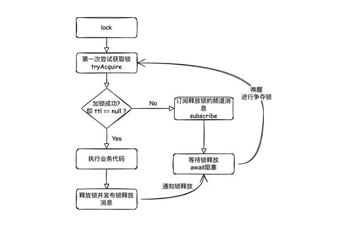
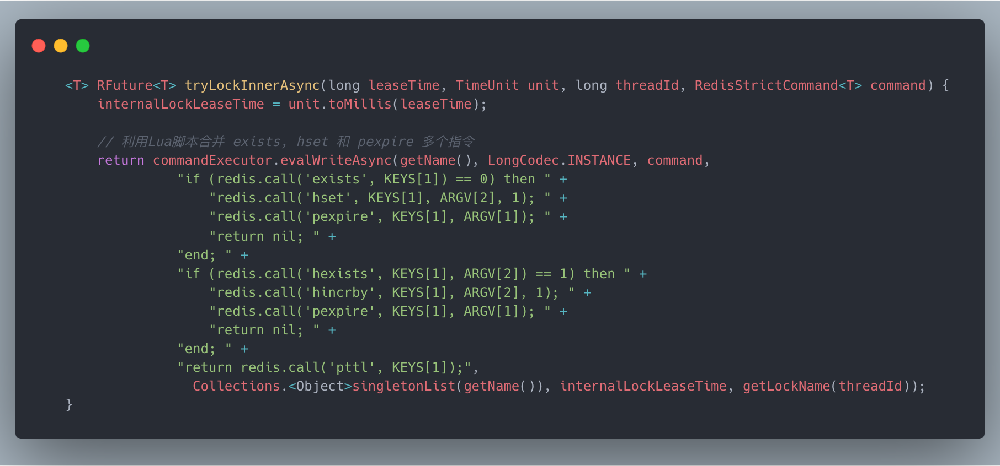
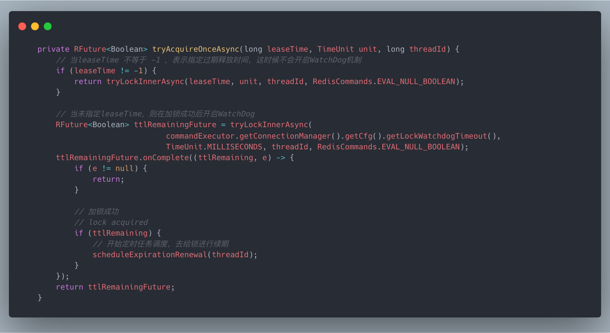
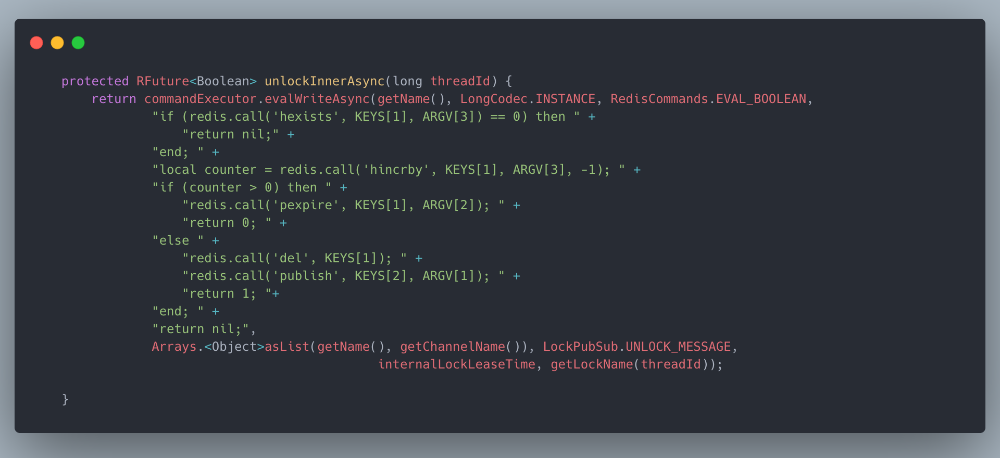

# Redisson 分布式锁

## 为什么需要分布式锁
在早期互联网的架构中，一个应用都是单机进行部署，这种情况下，利用JDK提供的锁机制即可解决共享数据在多线程场景下的线程安全问题，但随着技术的发展，分布式系统架构逐渐普及，在分布式架构中，由于一个应用会进行多机部署，服务器实例之间的JVM是互相独立的， 这时候利用JDK提供的锁在这种场景下是没办法共享的 ，所以需要依靠一个中间件实现在分布式的场景下对锁的共享，典型的如 **Redis **。

_为什么是Redis_
- 由于Redis中的数据是存放在内存中，读写速度很快，没有磁盘的IO，所以加锁和释放锁的速度会很快，性能很高。
- Redis对客户端的请求都是单进程单线程进行处理的，也就意味着串行化去执行的，所以Redis的单个命令是支持原子性的，即使对于多个Redis指令，Redis也提供了将多个指令合并在一个Lua脚本中一起执行，从而保证多条指令的原子性操作。

分布式锁的加锁和解锁的要求必须是原子性的，而Redis就可以很好的支持这一特性。

## 如何利用Redis实现锁机制
用一句话概括的说，其实Redis实现锁机制其实就是在Redis中设置一个key-value，当key存在时，即上锁，删除key即解锁。
当然要想实现一个很健壮的锁机制，这其中还有很多细节不容忽视，所以下面，我们一步一步的跟着思路去思考如何使用Redis实现一个分布式的锁：

1. 加锁保证互斥性，同一时间只能有一个客户端加锁成功。
   - 通过Redis的`setnx`命令实现，`setnx`即 set if not exists，当key不存在时才能设置成功
   
     ```shell
     SETNX key value
          summary: Set the value of a key, only if the key does not exist
          since: 1.0.0
          group: string
     ```
   
   - (推荐)通过`set key value PX 3000 NX`，PX指过期时间，NX即not exists，效果等同`setnx`，但是由于 `setnx` 不支持设置过期时间，所以需要拆分成两个两个命令`setnx key value` 和 `expire key 3`，要保证原子性还需要将两个命令合并为一个lua脚本。
     
     ```shell
     SET key value [EX seconds|PX milliseconds|EXAT timestamp|PXAT milliseconds-timestamp|KEEPTTL] [NX|XX] [GET]
       summary: Set the string value of a key
       since: 1.0.0
       group: string
     ```
   
   前面也提到，由于Redis是单线程的，所以当大量请求过来时，这些请求是串行化执行的，所以一定只有一个请求才能设置成功，从而保证了加锁的互斥性。
   
2. 防止死锁
   当客户端加锁之后，在释放锁之前如果Redis发生了宕机，那么Redis中的锁就无法自动释放，最终产生死锁，所以为了避免死锁，我们还需要给这个锁的key设置一个合理的过期时间，当锁占用的时间超过指定的过期时间，则自动删除该锁对应的key释放锁，让其他客户端能够有机会去争抢这个锁。
   
3. 锁过期提前释放
   上一步由于为了避免死锁，所以在加锁时，指定了锁的有效期，但是这个有效期也是估算出来的，如果实际业务处理时间超过了锁的有效期，锁会被提前释放，就会导致其他客户端获得了锁，从而导致锁机制的失效。
   所以为了解决该问题，就需要一个机制去对锁进行续期，防止在加锁的业务还未处理完之前，被提前释放，我们可以利用一个子线程，在锁有效期到期之前，定期的去的给锁进行续期，即：增加key的过期时间。
   
4. 释放锁
   释放锁，只需要将对应的锁的key从redis中删除即可，但是这里需要注意的是，在释放锁之前，必须判断只有是当前线程占用的锁才可以进行释放，所以锁的key对应的value我们就可以存放当前的客户端的身份标识，在释放锁之前，比对一下当前释放锁的客户端是否是当前加锁的客户端，如果匹配成功则可以正常删除对应的key释放锁，否则就不释放锁。

综合以上的对Redis实现锁的思路分析，其实市面上已经有了成熟的开源框架的实现，就是今天的主角 `Redisson`，`Redisson` 不仅实现了基于Redis实现加锁，解锁，还提供了
防死锁，锁续期，以及可重入的锁的功能，可以说能够满足大多数的场景了，下面我们就看下Redisson底层是如何实现Redis分布式锁的。

## Redisson原理

Redisson提供`RLock`的接口，继承了JUC包下的`java.util.concurrent.locks.Lock`， 所以加锁的方式和JDK提供的`ReentrantLock`加锁方式很类似。
我们先来看一段利用Redisson加锁的代码：
```java
        // 获取锁对象
        RLock lock = redissonClient.getLock("myLock");
        try {
            // 加锁， 5 代表锁过期自动释放的时间，单位为 秒
            boolean locked = lock.tryLock(5, TimeUnit.SECONDS);

            if (locked) {
                // 处理业务逻辑
            } else {
                // 未获取锁的逻辑
            }
        } finally {
            // 只有持有锁的线程才能释放锁
            if (lock.isLocked() && lock.isHeldByCurrentThread()) {
                lock.unlock();
            }
        }
```

1. 获取锁对象 `RLock lock = redissonClient.getLock("myLock");`
   
   这里`myLock`就是指定Redis中锁的**唯一标识**，关于key值需要根据实际业务来确定，一定要保证唯一性，而且key值也决定了锁粒度的大小。

2. 加锁

   Redisson常用的加锁方式如：lock，tryLock，方式的区别如下：

   - lock方式，无返回值，如果锁已经被其他客户端持有，会利用Redis中的PUB/SUB机制，订阅Redisson解锁消息，并且当前线程会进行await阻塞，当监听到解锁消息，阻塞的客户端会被唤醒进行锁争夺。

     
   - tryLock 方式是有返回值的，当加锁失败会返回一个false，交由调用方决定后续的操作。
   

   对于以上两种加锁方式，最终都会调用下面这段Lua脚本的代码进行加锁操作：

   

   对于上述的Lua脚本解读如下：

   a. 第一步通过 `exists key `去判断锁的key是否存在.

   b. 第二步，如果第一步中的判断返回0，表示 key 不存在，这时候可以加锁，利用`hset key value` 设置`key`的`value`，即`ARGV[2]`.

      > hset 代表这个key对应的value是一个hash类型，类似于HashMap，其中field代表客户端，value是重入次数。
      >
      > ARGV[2] 代表了加锁客户端的唯一标识，由UUID和线程id组成，可以理解为某个客户端的某个线程加锁。

   c. 第三步设置key的存活时间`internalLockLeaseTime`，这里 `ARGV[1]` 代表的是锁 key 的默认生存时间，默认 30 秒。

   如果a步骤中的`exists key`判断key已经存在，即`exists KEYS[1]` 返回1，则利用`hexists key field` 判断当前的客户端ID（即ARG[2]）在锁的key对应的hash数据结构中是否存在

   - 存在表明是当前客户端持有的锁，这时候就相当于锁重入，就利用`hincrby key field increment`去对锁重入进行 + 1，并通过`pexpire key millseconds`设置过期时间。
   - 不存在则表明当前持有锁是另外一个客户端，所以直接退出第二个if判断

   如果上述两个if条件都未满足，则`pttl key `返回当前锁的key的剩余存活时间。

3. 从上述描述可以看出，锁的key其实可以设置过期时间的，key一旦过期，redis就会清除这个key，如果当业务处理的时间超出了锁的有效期，这时候锁就会被其他客户端获取成功，会造成锁失效，所以在Redisson中还存在一个WatchDog的机制去对去定期（默认10秒）去给锁续期，即Redisson会开启定时任务`TimerTask`去定时对锁的有效期进行延长。
   这里需要注意的是，**WatchDog机制只有在我们未手工指定对应的锁过期时间`leaseTime`才会生效**
   
   
   
4. unlock 释放锁，释放锁的时候需要判断当前的客户端（`UUID + threadId`）是否持有锁，只有持有锁的客户端才能释放锁。

   
   
   unlock 其实最终也是通过Lua脚本进行解锁：
   
   a. 通过`hexists lockKey clientId`判断是否当前客户端持有锁，如果不是，则直接返回
   
   b. 如果是当前客户端持有锁，则对锁的重入次数`counter`进行-1，如果-1之后重入次数依旧大于0，说明锁被重入，需等待重入次数为0才可以解锁，这时候重新设置锁key的有效期。
   
   c. 如果重入次数已经为0，则开始释放锁，即`del lockKey`，并且发布一个锁释放的消息到channel中，通知其他等待锁的客户端进行加锁操作。

---

以上就是Redisson分布式锁的实现原理。

## Redisson 单机模式下的缺点
事实上这类锁最大的缺点就是它加锁时只作用在一个Redis节点上，如果Redis挂了，那么就会产生单点故障的问题，
即使Redis通过sentinel哨兵机制保证高可用，当master节点发生故障后，可以故障转移，slaver升级为master，
但由于主从之间的数据同步是异步的， 如果在发生主从切换的时候，key 还没来得及同步到slaver上，那么就会出现锁丢失的情况：

   1. 在Redis的master节点上拿到了锁；
   2. 但是这个加锁的key还没有同步到slave节点；
   3. master故障，发生故障转移，slave节点升级为master节点；
   4. 导致锁丢失


所以Redis对于这种场景提供`RedLock`红锁，即对主节点master的Redis进行集群，多个master实例间互相独立，需要对N个实例进行上锁，这里假设有5个Redis集群，当获取锁的时候，当且仅当大多数的节点（即 N/2 + 1）都设置锁成功，整个获取锁的过程才算成功，如果没有满足该条件，就需要在向所有的Redis实例发送释放锁命令即可，不用关心之前有没有从Redis实例成功获取到锁.

> 这里顺手推荐一篇比较好的文章 https://segmentfault.com/a/1190000041172633
