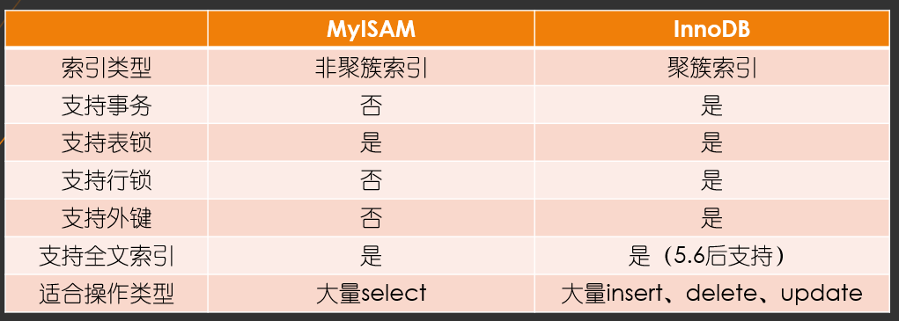
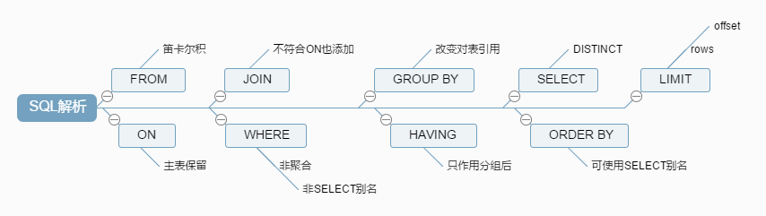
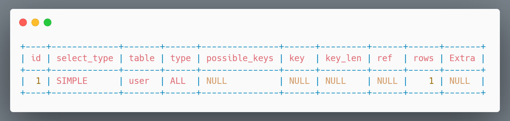

## Mysql 的状态监控

show global variables like '%%'; 查看配置信息

set profiling = 1;

show profiles;能够显示更精确的查询花费时间。

### performance_schema

用于监控MySQL Server的在运行过程中的资源消耗和资源等待的情况，利用事件监听的方式监视server的运行情况。

事件可以是函数的调用，操作系统的等待，SQL语句的执行。

```sql
--1. 哪类的SQL执行最多？
SELECT DIGEST_TEXT,COUNT_STAR,FIRST_SEEN,LAST_SEEN FROM events_statements_summary_by_digest ORDER BY COUNT_STAR DESC;

--2. 哪类SQL的平均响应时间最多？
SELECT DIGEST_TEXT,AVG_TIMER_WAIT FROM events_statements_summary_by_digest ORDER BY COUNT_STAR DESC;

--3. 哪类SQL扫描记录数最多？
SELECT DIGEST_TEXT,SUM_ROWS_EXAMINED FROM events_statements_summary_by_digest ORDER BY COUNT_STAR DESC;

--4. 哪类SQL返回结果集最多？
SELECT DIGEST_TEXT,SUM_ROWS_SENT FROM events_statements_summary_by_digest ORDER BY COUNT_STAR DESC
--5. 哪个表物理IO最多？
SELECT file_name,event_name,SUM_NUMBER_OF_BYTES_READ,SUM_NUMBER_OF_BYTES_WRITE FROM file_summary_by_instance ORDER BY SUM_NUMBER_OF_BYTES_READ + SUM_NUMBER_OF_BYTES_WRITE DESC
```

### 数据类型优化

- 简单就好：如对于日期，能用date就使用date类型，不要使用varchar，首先是效率的问题， 其次无法使用日期的函数
- 更小的通常更好，字段的类型，在满足实际情况的前提下
  - varchar 在大于225时会额外占用两个字节保存长度
  - char 最大长度255，会自动删除末尾的空格，检索的效率比varchar要高，以空间换时间
  - datetime占用8字节，精确到毫秒，与时区无关，可保存的时间的范围大
  - timestamp占用4字节，精确到秒，采用整形去存储，与时区有关，时间范围1970-01-01~2038-01-19
  - date 占用3字节，范围为1000-01-01~9999-12-13
- 尽量避免null，索引在处理null时比较复杂

### 数据库引擎

show engines; 可以查看所有支持的数据库引擎。

MyISAM 与 InnoDB的区别：



### 执行计划

#### sql解析



#### explain + sql 查看sql的执行计划



关于explain输出的列解释如下：

- id：select查询的序列号，包含一组数字，表示查询中执行select子句或者操作表的顺序

  - 如果id相同，那么执行顺序从上到下
  - 如果id不同，如果是子查询，id的序号会递增，id值越大优先级越高，越先被执行
  - id相同和不同的，同时存在，相同的可以认为是一组，从上往下顺序执行，在所有组中，id值越大，优先级越高，越先执行
- select_type：主要用来分辨查询的类型，是普通查询还是联合查询还是子查询
- table：对应行正在访问哪一个表，表名或者别名，可能是临时表或者union合并结果集
- **type**：显示的是访问类型，访问类型表示我是以何种方式去访问我们的数据，最容易想的是全表扫描，直接暴力的遍历一张表去寻找需要的数据，效率非常低下，访问的类型有很多，效率从最好到最坏依次是：system > **const** > eq_ref > **ref** > fulltext > ref_or_null > index_merge > unique_subquery > index_subquery > **range** > **index** > **ALL**

  - **ALL**：就是全表扫描
  - **index**：全索引扫描这个比ALL的效率要好，主要有两种情况，一种是当前的查询时覆盖索引，即我们需要的数据在索引中就可以索取，或者是使用了索引进行排序，这样就避免数据的重排序
  - **range**：表示利用索引查询的时候限制了范围，在指定范围内进行查询，这样避免了index的全索引扫描，适用的操作符： =, <>, >, >=, <, <=, IS NULL, BETWEEN, LIKE, or IN()
  - index_subquery：利用索引来关联子查询，不再扫描全表
  - unique_subquery：该连接类型类似与index_subquery,使用的是唯一索引
  - index_merge：在查询过程中需要多个索引组合使用
  - ref_or_null：对于某个字段即需要关联条件，也需要null值的情况下，查询优化器会选择这种访问方式
  - **ref**：使用了非唯一性索引进行数据的查找
  - eq_ref ：使用唯一性索引进行数据查找
  - const：这个表至多有一个匹配行
  - system：表只有一行记录（等于系统表），这是const类型的特例，平时不会出现

  **通常要求一个SQL的查询至少达到range级别，最好能达到ref**
- possiable_keys： 显示可能应用在这张表中的索引，一个或多个，查询涉及到的字段上若存在索引，则该索引将被列出，但不一定被查询实际使用
- **key**：实际使用的索引，如果为NULL，则没有使用索引，查询中若使用了覆盖索引，则该索引和查询的select字段重叠。
- **key_len**：表示索引中使用的字节数，可以通过key_len计算查询中使用的索引长度，在不损失精度的情况下长度越短越好。
- **ref**：显示索引的哪一列被使用了，如果可能的话，是一个常数
- **rows**：根据表的统计信息及索引使用情况，大致估算出找出所需记录需要读取的行数，**此参数很重要，直接反应的sql找了多少数据，在完成目的的情况下越少越好**
- **Extra**：包含额外的信息

  - using filesort:说明mysql无法利用索引进行排序，只能利用排序算法进行排序，会消耗额外的位置
  - using temporary:建立临时表来保存中间结果，查询完成之后把临时表删除
  - using index:这个表示当前的查询时覆盖索引的，直接从索引中读取数据，而不用访问数据表。如果同时出现using where 表明索引被用来执行索引键值的查找，如果没有，表明索引被用来读取数据，而不是真的查找
  - using where:使用where进行条件过滤
  - using join buffer:使用连接缓存
  - impossible where：where语句的结果总是false

### 索引

#### 为什么要建立索引

- 大大减少服务器需要扫描的数据量
- 帮助服务器避免建立临时表
- 因为索引是有序的，所以可以将随机IO变成顺序IO

#### 聚簇索引和非聚簇索引

聚簇索引：将数据存储和索引存储在一起，通过主键索引查找到叶子节点即可获取到行数据。

非聚簇索引：数据和索引不存储在一起，通过索引的叶子节点只能拿到数据行的地址，再通过地址去磁盘查找数据。

在InnoDB数据库引擎下，因为只有主键索引的叶子节点存放数据，所以InnoDB必须要有一个聚簇索引，规则如下：

- 如果表指定了主键，则利用主键作为聚簇索引
- 未指定主键，则将第一个非空且唯一的索引作为聚簇索引
- 以上条件都不满足，则会建立一个隐藏的row_id作为聚簇索引

#### 索引的分类

- 主键索引
- 唯一索引：alter table tablename create unique index uk_idx(column);
- 普通索引: alter table tablename create index idx(column)
- 组合索引: alter table tablename create index idx_a_b_c(column_a, column_b, column_c)，索引最多包含16个列，但是建议不超过5个
- 全文索引

#### 索引的数据结构

- 哈希：只有memory的存储引擎使用，
- B+树，使用B+树作为索引数据结构的好处：
  - 提升索引查询的IO效率
  - 查询IO次数少，特别是范围查询
  - 所有查询最终获取数据都要找到叶子节点，查询性能稳定
  - B+树的元素都是有序的

#### 索引匹配原则

- 全值匹配：指的是和索引中的所有的列进行匹配
- 匹配最左前缀：在where中利用索引进行过滤时，条件的顺序需要和索引的顺序一致，否则不走索引，例如表staffs，有联合索引（name,age,pos）
  - explain select * from staffs where name = 'July' and age = 23;走索引（name,age）
  - explain select * from staffs where age = 23 and  name = 'July';走索引（name,age），第一个和第二个顺序可以随意，mysql查询优化器会自动优化
  - explain select * from staffs where  age = '23';不走索引，因为跳过了name，所以就无法走索引
- 匹配列前缀：例如对索引列进行 like 'A%'

#### 回表，覆盖索引，最左匹配，索引下推

- 回表：在普通索引下，索引树的叶子节点只存放了主键，当利用普通索引检索数据的时候，先拿到叶子节点的主键，再通过主键走主键索引树，从而从主键索引的叶子节点拿到数据行。
- 覆盖索引，当需要查询的字段刚好处于索引的字段中，这时候，就不需要进行回表，直接返回索引的数据值
- 最左匹配原则：在where中利用索引进行过滤时，条件的顺序需要和索引的顺序一致，否则不走索引
- 索引下推：首先根据索引来查找记录，然后再根据where条件来过滤记录；在支持ICP优化后，MySQL会在取出索引的同时，判断是否可以进行where条件过滤再进行索引查询，也就是说提前执行where的部分过滤操作，在某些场景下，可以大大减少回表次数，从而提升整体性能。

  比如，现在staffs表的索引为index(name, age)，这时候利用select * from staffs where name like '王%' and age = 20;如果没有索引下推优化， 在 like '%王'之后的条件都不会走索引，假设like查询到了10条，那么就会一条条的去回表进行查询，最终就会回表10次，但是有了索引下推的优化，在查询索引的同时，就会去判断age，这样满足条件数据量就小了，回表的次数也就减少了，利用explain 可以看到Extra 输出 Using index condition

#### 哪些情况适合建索引

- 频繁作为where条件语句查询的字段
- 关联字段需要建立索引，如外键字段
- 排序字段需要建立索引
- 分组字段需要建立索引
- 统计字段需要建立索引，如count()，sum()，max（）

#### 哪些情况不适合建立索引

- 频繁更新的字段不适合
- where语句查询中用不到的字段不适合
- 表数据比较少
- 数据重复性比较高或者分布很均匀的字段，如性别
- 参与列计算的字段不适合建立索引

#### 索引失效

#### 页分裂和页合并

##### 页分裂

在索引树的叶子节点，存放的其实是一页一页的数据，默认大小为16K，并且B+树的每一层都相当于是一个双向的链表，有前一页和后一页的指针，当发生数据新增时，通过索引确定叶子节点的页时，如果数据的大小超出了页的最大容量，这时顺着下一页的指针放入到下一页中，但凑巧的是，下一页容量也不足以存放该数据，这时候就需要考虑页分裂，新增一个页出来，然后存入数据，并改变原有叶子节点之间的指针。

##### 页合并

当发生数据删除时或者UPDATE时，当页中的数据大小小于页删除的一个阈值（MERGE_THRESHOLD），就会尝试将当前页与最近的页进行合并，以优化空间使用。

以上页分裂和页合并发生时，mysql会对索引树上加上X锁。

### 优化细则

- 当使用索引列进行查询过滤时，尽量不要使用表达式，如 +
- 尽量使用主键索引，而不是其他索引（二级索引），因为主键索引不会发生回表
- 对存放字符长度比较长的字段使用前缀索引，前提是保证索引选择性，可以利用select count(distinct left(name, 3))/count(*) from staffs;计算出区分度，越接近去全值比例越好，alter table staffs add key (name(3));
- 给order by 的列创建索引，利用索引进行排序
- union all ,in, or 都可以走索引，而union因为会进行去重并且排序，所以效率低
- 范围查询如 < 或者 > 可以使用索引，但是需要注意的是在范围查询后的列无法使用索引
- 强制类型转换不会使用索引，如一个手机号字段是varchar,结果过滤时传入的是一个数值，这时会发生类型转换
- 更新十分频繁，数据区分度不高的字段上不宜建立索引，更新会变更B+树，更新频繁的字段建议索引会大大降低数据库性能， 一般区分度在80%以上的时候就可以建立索引，区分度可以使用 count(distinct(列名))/count(*) 来计算
- 创建索引的列，不允许为null，可能会得到不符合预期的结果
- 当需要进行表连接的时候，最好不要超过三张表，因为需要join的字段，**数据类型必须一致**
- 能使用limit的时候尽量使用limit，当表的数据量很大的时候，可以用join的方式优化limit查询，如select * from staffs limit 100000,10;可以优化成select * from staffs s inner join (select staff_id from staffs limit 10000,10) b on b.staff_id = s.staff_id;
- 单表索引建议控制在5个以内，
- 单索引字段数不允许超过5个（组合索引），最大支持16个
- join 和 exists：join 适合驱动表是小表，被驱动表是大表，exists适合驱动表是大表，被驱动表是小表
- not in 和 not exists

### 查询优化

查询性能低下的主要原因就是访问的数据量太大，某些查询不可避免需要筛选大量数据，所以可以通过减少扫描的数据量来进行优化。

避免向数据库请求了不需要的数据，如查询不需要的数据，多表关联返回了全部的列，总是取出全部的列，重复查询了相同的列

### 表分区partition

表分区是对数据库海量数据的一种水平切分的方式，当数据量很大时，可以通过分区表将一张大表数据拆分到不同的分区表中，比如表中的数据历史数据占据很大一部分，只有一部分才是热点数据，可以考虑采用分区表，这样在查询时可以减少IO量，提升性能，但前提是查询条件必须带上分区条件，否则会扫描所有的分区的数据或索引，反而会增大查询的IO量。

场景：以电商中的订单表为例，假设业务量很大，这时候就可以按照月或者年的维度存放到不同的分区表中：

```sql
CREATE TABLE `orders` (
  order_id int NOT NULL auto_increment primary key,
  order_code varchar(20) NOT NULL,
  order_status char(1) NOT NULL,
  order_price decimal(15,2) NOT NULL,
  order_date date NOT NULL
)

PARTITION BY RANGE (YEAR(order_date))
(
  PARTITION p2000 VALUES LESS THAN (2000) ENGINE = InnoDB,
  PARTITION p2001 VALUES LESS THAN (2001) ENGINE = InnoDB,
  PARTITION p2002 VALUES LESS THAN (2002) ENGINE = InnoDB,
  PARTITION p9999 VALUES LESS THAN (MAXVALUE)
)
```

### MySQL的日志

在MySQL中除了常见的错误日志，查询日志外，还有有以下几种日志类型：

- **Redo log**: 是为了实现事务一致性，Redo log是InnoDB存储引擎下的日志，当事务开启后，发生数据修改的时候，InnoDB会先将数据更新到内存，而不是立刻就写入磁盘中，并记录redo log到os buffer中，此时redo log 进入prepare阶段，当发生事务的commit时，才一次性的进行fsync()将redo log 写入到磁盘日志文件中并标记redo log 为commit。当数据库服务失效重启后，通过redo log 就能够恢复数据，这样便实现了事务的一致性。
- **Undo log**：是实现事务的原子性的基础，原子性要求事务是最小不可分割的操作单元，在事务中的操作要么全都成功，要么全部失败，没有中间状态。Undo log 在操作任何数据的新增修改前，首先会将数据备份到Undo log 中，然后再进行数据的修改，如果事务中的某个操作发生错误，需要回滚RollBack，则数据库引擎可以利用Undo log回退到事务开始之前的状态，Undo log 不仅可以实现事务的原子性，Mysql中的多版本并发控制MVCC机制也是利用Undo log实现。
- **Bin log**：是MySQL Server层产生的日志，主要作用是用来数据库的恢复、备份或者复制，比如mysql集群模式下的slaver同步master的数据就是通过bin log。

#### MVCC 多版本并发控制

是提高数据库并发的技术，早期的时候，只有读读之间不会阻塞，而读写，写读，写写之间都会进行阻塞，所以才有了MVCC机制，只有写写之间才会阻塞，大大提升了并发度。

既然是多版本，那么说明每个版本都有自己对应版本号，在这里其实就是事务的id(trx_id)，并且在trx_sys中还维护了一个全局的活跃的读写事务Id的集合。

那么如果想去找到历史版本就需要找到对应的undo log，而undo log 其实是一个链式的，每一个undo log 都会有一个指针指向前一个历史版本的undo log

在InnoDB中，每一行数据除了正常的列之外，还会有一些隐藏的列：

- trx_id：指当前行数据最后修改的一个事务ID
- db_roll_ptr：指向历史版本的undo log  的指针

除了以上几个条件外，还有个ReadView，ReadView的作用是在事务开启后的第一个查询select时，会构建当前事务的一个视图，会将当前trx_sys中活跃的事务ID拷贝一份到ReadView中，当前视图中有以下几个重要的属性：

- trx_ids：即活跃的事务id列表。
- up_limit_id ：即当前活跃事务的最小事务ID。
- low_limit_id: 即当前活跃事务列表中最大的事务ID

如何保证哪些事务对当前可见，哪些不可见呢？

- up_limit_id ：小于up_limit_id的事务ID即表示是在ReadView创建前就已经提交的，所以小于up_limit_id的那些事务id对应的版本是当前可见的。
- low_limit_id: 大于low_limit_id的事务ID是在创建ReadView之后产生的，对当前是不可见的。
- trx_ids：应该是介于up_limit_id 和low_limit_id之间，即 up_limit_id < trx_ids < low_limit_id，如果版本对应的tx_id在tx_ids中，即不可见，如果不在trx_ids中，即在创建ReadView时已经提交了，所以对当前可见。

### Mysql中的锁
