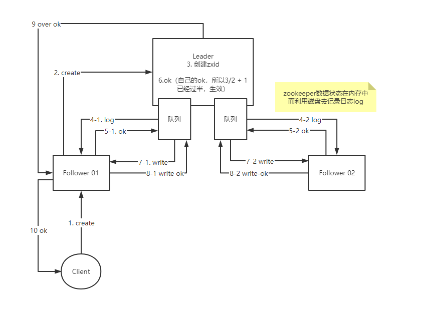

# ZooKeeper

ZooKeeper 是分布式开源协调服务。

ZooKeeper 是一个典型的分布式数据一致性解决方案，分布式应用程序可以基于 ZooKeeper 实现诸如数据发布/订阅、负载均衡、命名服务、分布式协调/通知、集群管理、Master 选举、分布式锁和分布式队列等功能。

Zookeeper 一个最常用的使用场景就是用于担任服务生产者和服务消费者的注册中心。

服务生产者将自己提供的服务注册到Zookeeper中心，服务的消费者在进行服务调用的时候先到Zookeeper中查找服务，获取到服务生产者的详细信息之后，再去调用服务生产者的内容与数据。在 Dubbo架构中 Zookeeper 就担任了注册中心这一角色。

> [可能是全网把 ZooKeeper 概念讲的最清楚的一篇文章 - 知乎 (zhihu.com)](https://zhuanlan.zhihu.com/p/44731983)

## 安装Zookeeper

在集群模式下，首先需要关闭每台机器的防火墙。
centos 7 关闭防火墙
systemctl status|stop firewalld.service 

开机启动/禁用防火墙

systemctl disabled|enabled firewalld.service

centos 7 修改静态IP
cd /etc/sysconfig/network-scripts
vi ifcfg-ens33

1. wget 下载jdk，并配置环境变量
2. wget zookeeper，tar xf zookeeper.tar.gz
3. mkdir /opt/leofee
4. cp -r zookeeper /opt/leofee
5. export ZOOKEEPER_HOME=...
6. cd /zookeeper/conf
7. cp zoo_sample.cfg zoo.cfg
   1. dataDir
   2. server.1=node01:2888:3888
8. mkdir /var/zookeeper/myid
9. echo 1 > /var/zookeeper/myid
10. 利用scp分发到其他机器
11. zkServer.sh start-foreground

## Zookeeper中的关键概念

### Session

在Zookeeper中对于客户端的连接是有Session的概念的，并且Zookeeper对于客户端连接是透明的，客户端连接Zookeeper集群时，是随机连接任意一台实例，当客户端连接到任意一台Zookeeper实例的时候，Zookeeper会分配一个全局唯一的SessionId，注意是全局的，在集群模式下，所有的实例都会保存该SessionId，这样是为了保证在集群模式下，客户端连接任意一台实例都是有效的。

客户端与Zookeeper建立的连接是一个长连接，这样Zookeeper就可以通过心跳的机制去判断客户端是否还保持着连接，而且对于Watch回调，也是通过该连接实现。

当客户端于Zookeeper断开了连接，这时就会进入SessionTimeOut失效的倒计时，默认的SessionTimeOut是介于2**tickTime ~ 20* *tickTime之间（tickTime见zoo.cfg配置文件）。

### 节点Znode

Zookeeper中数据的保存都是在节点上，所以节点也就是zookeeper的数据单元。

Zookeeper中的数据结构类似于文件系统，如/path1/path2...和文件系统不同的是，Zookeeper的节点上可以保存数据，为了Zookeeper的高效，每个节点的数据大小不能超过1M。

Zookeeper的Znode节点类型主要分为临时节点（EPHEMERAL）和持久化节点（PERSISTENT）：

- 持久化节点(PERSISTENT)：在节点创建后，除非主动删除，否则会一直存在。
- 持久化顺序节点(PERSISTENT_SEQUENTIAL)：在持久化节点的特性上额外增加了节点的时序，在父节点下创建子节点时会按照创建顺序给节点名称后追加一个数字后缀用于表示节点的顺序。
- 临时节点（EPHEMERAL）：临时节点的生命周期是和session的生命周期一致，也就是说当客户端的会话失效后，该临时节点就会被清除，这里要注意的是会话失效，当客户端断开和zookeeper的连接时，只有超过了session的有效期，临时节点才会被删除。
- 临时顺序节点（EPHEMERAL_SEQUENTIAL）：

### Zookeeper 的事务

在Zookeeper中存在事务的概念，客户端对Zookeeper中的每一个写操作，都会分配一个全局的唯一的递增的序号，这个序号就是Zookeeper的事务ID，zxid，所以就保证了顺序性，这也是为什么Zookeeper能实现最终一致性的一个原因。

### Zookeeper中的角色

Zookeeper为了保证高可用，都是采用集群模式部署，集群模式最典型的就是基于主从模型（Master-Slaver），在Zookeeper中每台实例都有自己的角色，Zookeeper的角色主要分为以下几种：

- **Leader**：负责集群中所有写的事务，并且也支持读，当Zookeeper集群收到写的操作（如 `create, set ,delete`），
- **Follower**： 负责处理客户端的读操作，不参与写操作，当Follower收到写操作时会转发给Leader去执行，Leader执行完之后再同步给Follower。Follwer还会参与Leader的选举。
- **Observer**：该角色对于客户端的读写操作是和Follower一致的，目的是为了提升集群的吞吐量，但是不参与Leader的选举，因为Zookpeer为了保证选举的效率，当Follower实例增加时，会提升Leader的选举复杂度。

通过以上的角色我们可以看出，Zookeeper其实是读写分离的：

- 只有Leader才能写
- Follower只能读，只有Follower才能参与选举。
- Observer只能读，不参与选举。

## ZAB协议

ZAB是对 **[paxos](https://www.douban.com/note/208430424/)** 的一个精简版本。ZAB又称为原子广播协议。

ZAB协议主要有以下几个特性：

- 原子性：要么成功，要么失败，没有中间状态。所以在zookeeper中写数据也需要过半才算成功，否则就是失败。

- 广播：分布式是多节点的。不代表全部知道。数据同步就需要广播到所有节点。

- 队列：先进先出FIFO，具有顺序性。zookeeper对于客户端的请求是都串行化执行的。

#### ZAB协议保证了Zookeeper的最终一致性。

## Zookeeper Leader选举

首先在集群模式中，每个实例之间是两两通信的。

Leader的选举规则：

- 先比较zxid，即事务ID
- 再比较myid

在某个Follower在接受到任意一个选举Leader投票时，会被动给自己投票，并且如果当前的实力要大于投票者时，会返回自己的实力，并广播给其他Follower。

## Watch 机制

watch是一次性的，watch指的是观察并且会产生回调callback。

在Zookeeper的API中，exists ，getData，都支持传入一个Watcher，这样在exists节点存在时，就会触发回调，getData也是在能够获取到节点数据时进行回调。

## Zookeeper 应用

#### 分布式配置管理

#### 分布式锁

1. 只有一个线程能获取锁。
2. 防死锁，如果已经获取锁的线程异常退出，需要自动去释放锁，利用Zookeeper临时节点
3. 只有获取锁的线程可以释放锁
4. 锁被释放，如何通知其他线程
   1. 主动轮循去查看锁是否释放，弊端是轮循存在延迟，效率低，并且消耗服务器性能
   2. 利用watch机制，watch 父节点，如果锁释放，采用回调通知，弊端是，会有惊群的问题，因为会通知其他线程，这是大量线程又会继续去抢占锁，对服务器压力大。
   3. 利用watch + 临时序列节点，抢占锁时，创建临时有序的节点，只有最小的才可以获取锁，释放锁，只需要通知下一个节点即可，即watch前一个节点即可，相当于排队。